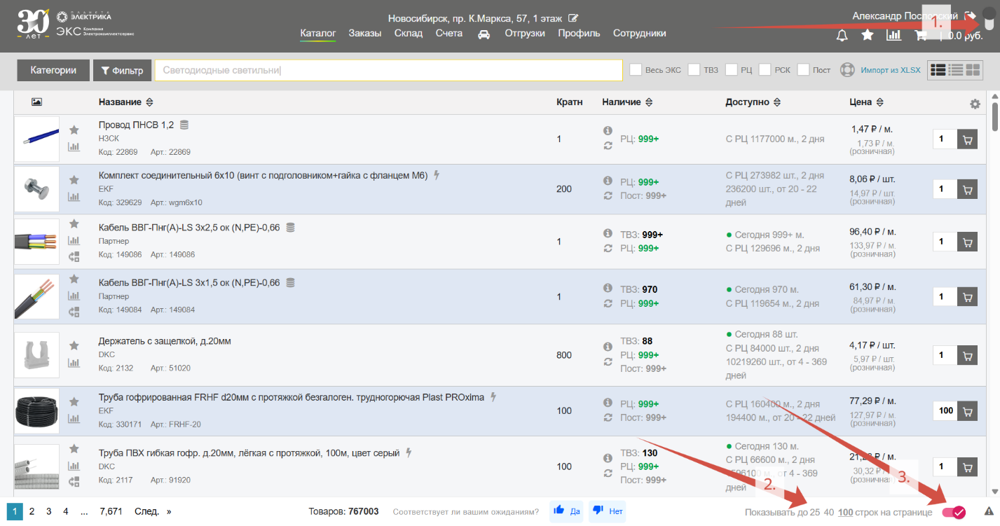
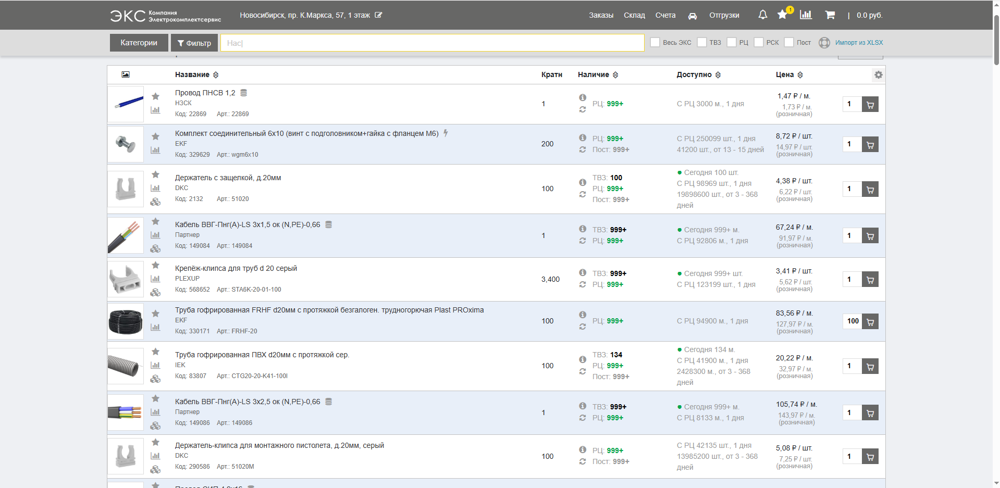
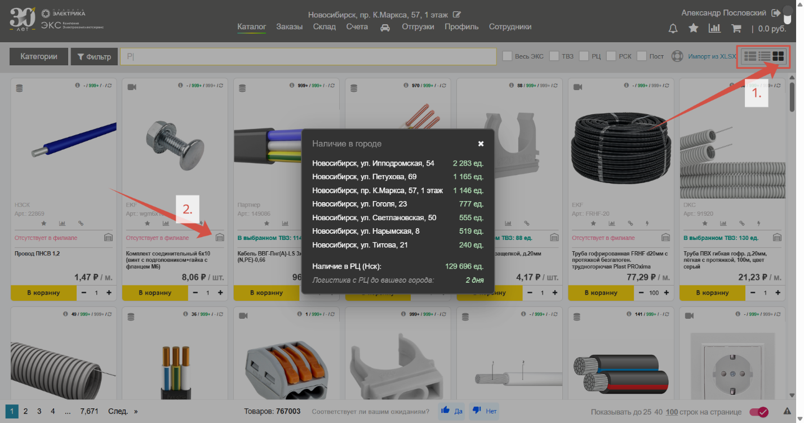
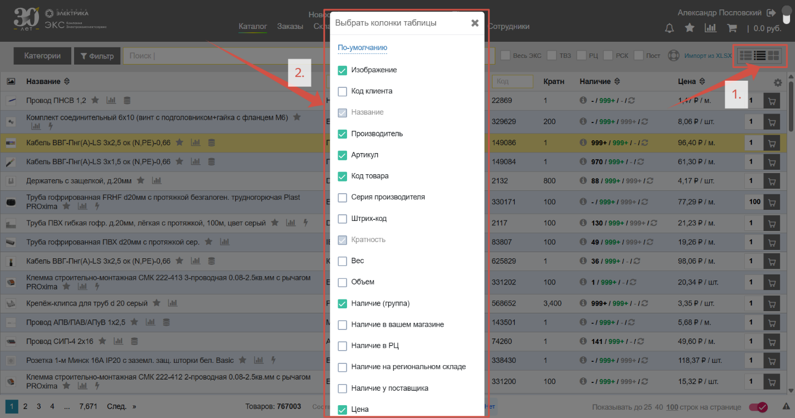

## Базовые настройки 

* Переключайтесь между **светлой и темной темой** (*1.*)
* Выбирайте **сколько товара отображать** на странице (*2.*)
* Открывайте **товар в новой вкладке** браузера, чтобы сохранить вкладку с результатами поиска (*3.*)

## Представления товаров

Существует 3 варианта представления товаров: 

1. **Список** — стандартный вариант представления товаров на сайте, компактный и отражающий наиболее важную информацию:

   

2. **Плитка** — интерфейс, напоминающий классический сайт elektro.ru (*1.*), наиболее привычен для розничных покупателей. Этот же вид используется для мобильной версии ЭКС.Бизнес. Полезная особенность – нажмите на иконку «**Склад**» (*2.*) и увидите остатки товара по филиалам вашего города:

  

3. **Таблица** — удобен, если привыкли работать с таблицами или системами похожими на Весту или 1С. Глубокие персональные настройки через «**Шестеренка**» (*1.*) позволяют добавлять или скрывать колонки с информацией. При зажатии левой кнопки мыши (ЛКМ) можно упорядочивать колонки (*2.*):

 