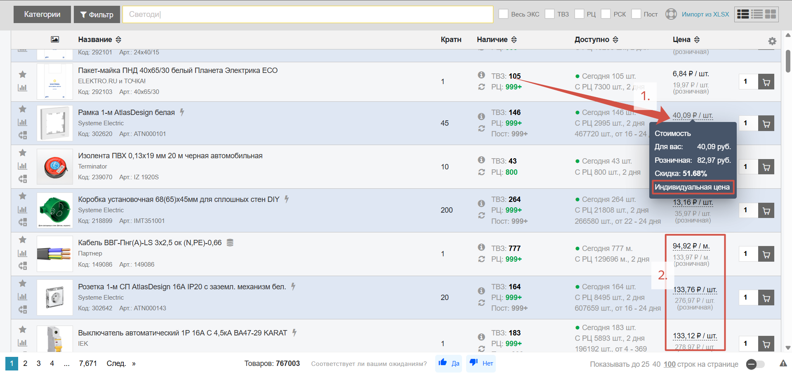
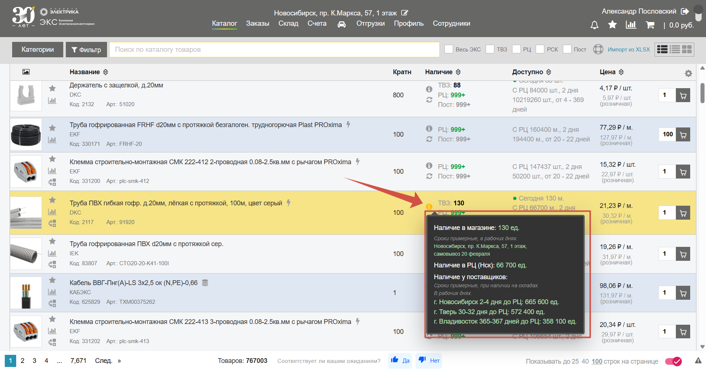
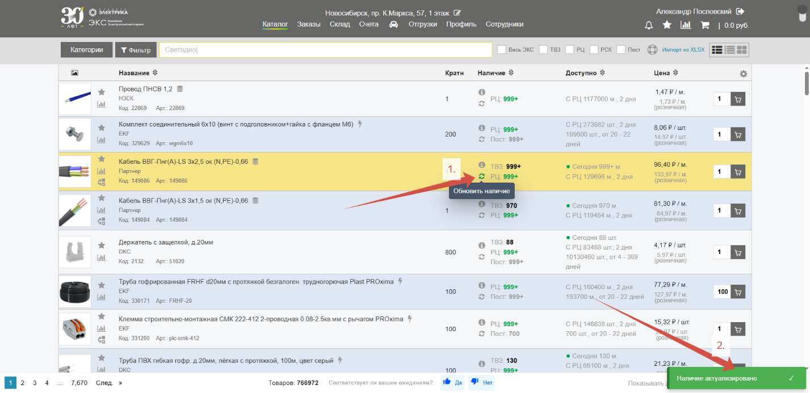
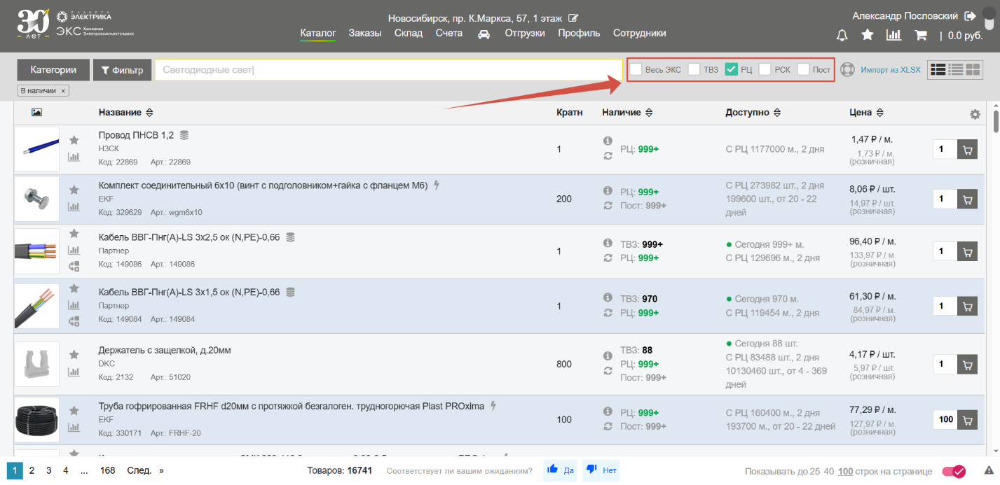

## Персональные цены на товары

Наведитесь курсором мыши на стоимость и увидите информационное окно с сведениями о своей **персональной цене** (*1.*). Позиции с индивидуальными условиями будут подчеркнуты **пунктирной линией** (*2.*):

## Сроки и количество товара

Информация о доступности и сроках доставки товара представлена в соответствующих колонках. Нажмите на иконку «**i**» для получения подробной справки: 

## Обновление остатков

Кнопка «**Обновить наличие**» (*1.*) позволяет обновить остатки по конкретной позиции. При нажатии сайт обратится к учетной системе и выведет актуальное количество товара на складах за последние 30 минут. После успешного обновления высветится соответствующее сообщение (*2.*):

## Товар в наличии в...

Включение переключателей сбоку от поисковой строки отобразит только тот **товар, который есть в наличии** в:

1.  **ТВЗ** (Торгово-выставочный зал) – магазин, за которым вы закреплены;
   
2.  **РЦ** (Распределительный центр) – главный склад по адресу г.Новосибирск, ул. Петухова, 69;

3.  **РСК** (Региональный склад) – склады в других городах; 

4.  **Пост** – склад поставщика;

5.  **Весь ЭКС** — включает всю сеть.

