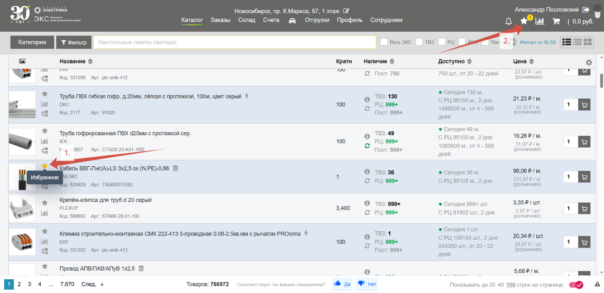
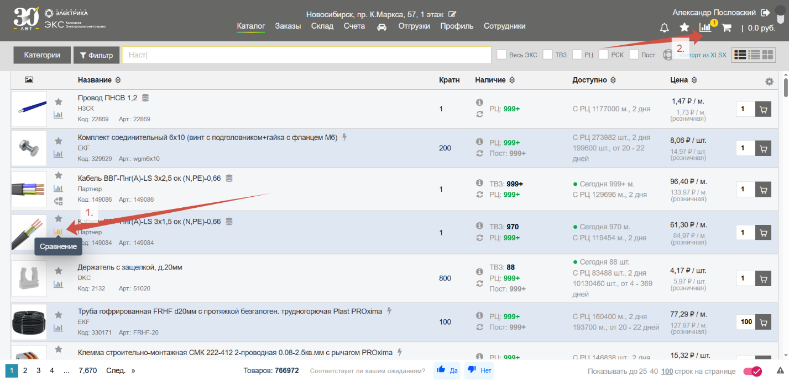
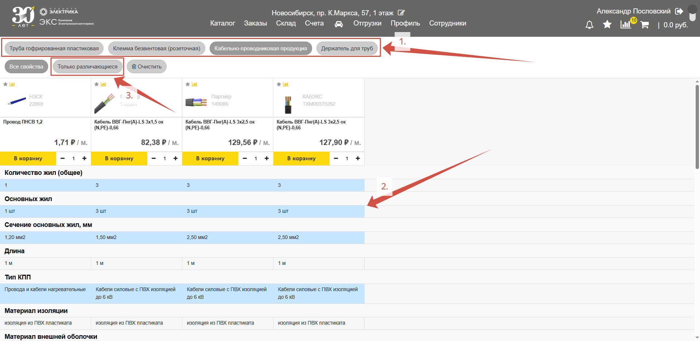
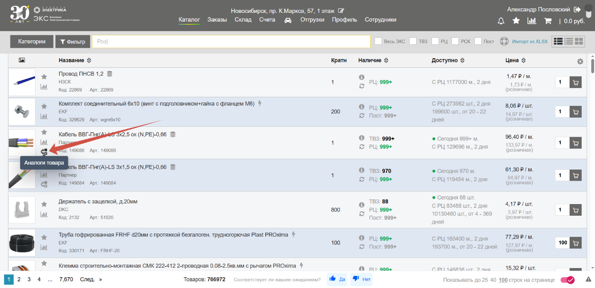
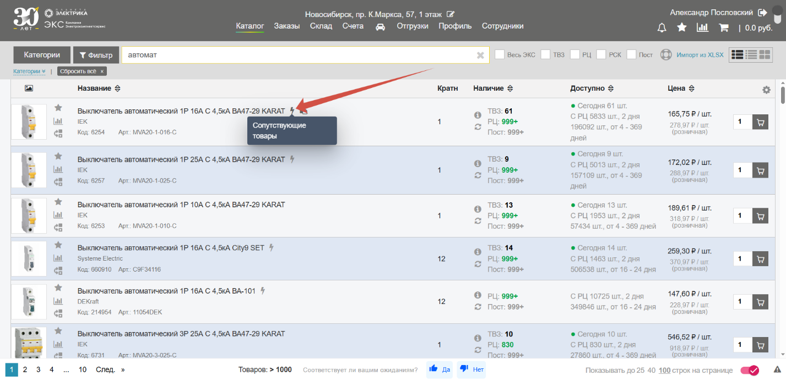
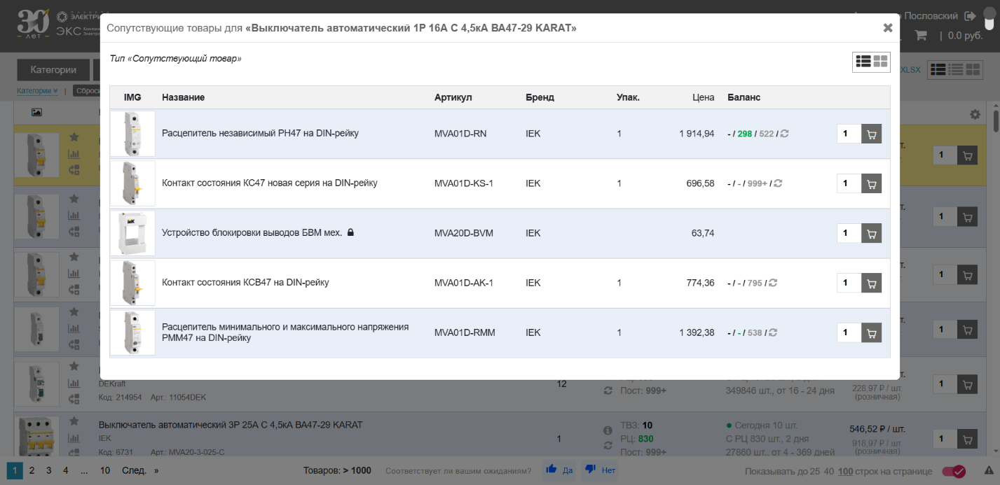
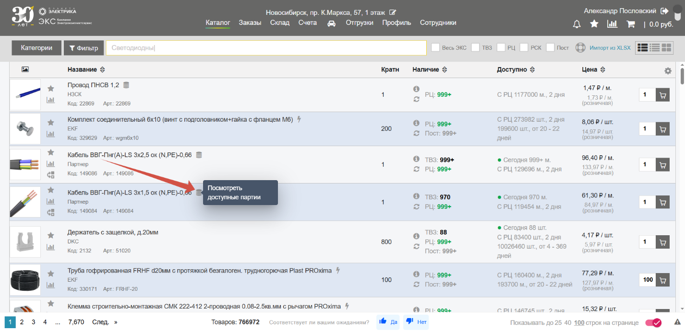
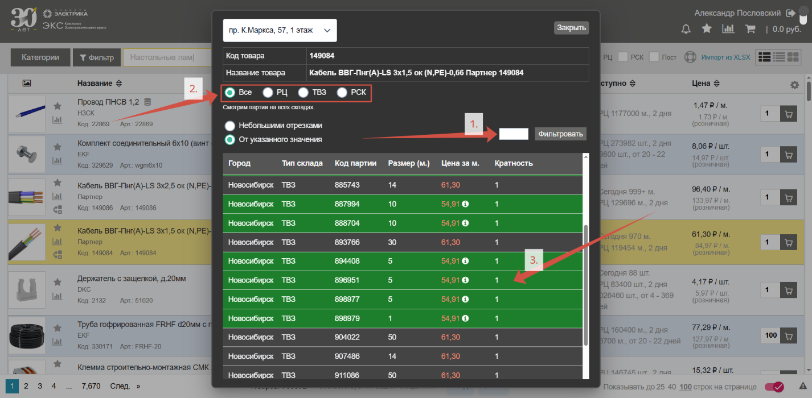
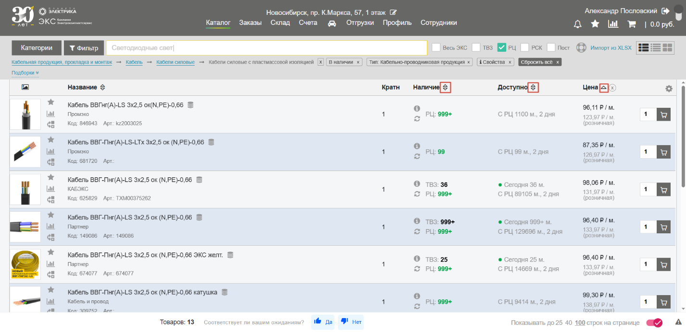
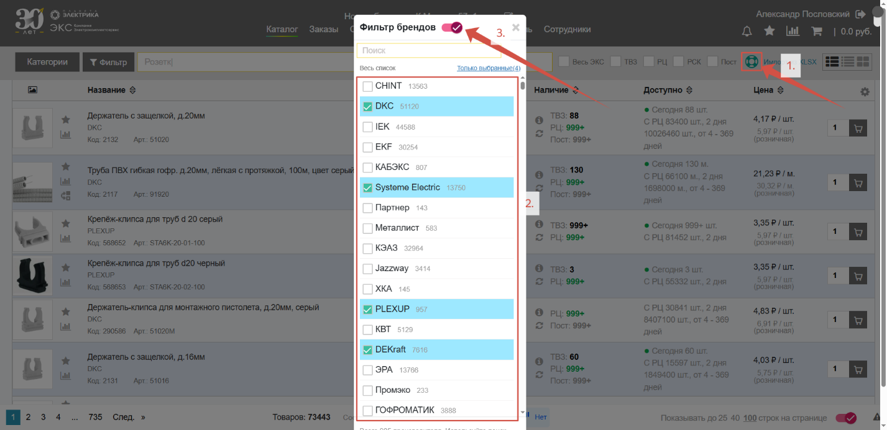

## Избранное

Кнопка «**Избранное**» (*1.*) позволяет добавлять позиции в отдельный список для быстрого доступа к ним (*2.*):

## Сравнение

Кнопка «**Сравнение**» (*1.*) позволяет добавлять позиции в список к сравнению (*2.*):

К сравнению можно добавлять **любые** товары, сайт сам распределит их на категории (*1.*) Цветом будут выделены различающиеся характеристики (*2.*). Нажмите кнопку «**Только различающиеся**» чтобы отобразить только различающиеся характеристики (*3.*): 

## Аналоги

Кнопка «**Аналоги товара**» выводит список аналогичных по ключевым характеристикам позиций:

## Сопутствующие товары

У некоторых товаров справа от наименования можно увидеть иконку «**Молния**». Нажав на эту кнопку выводится **список сопутствующих товаров**, которые производитель в рамках серии товаров добавил, как подходящие к нему:  

## Доступные партии

У кабельно-проводниковой продукции справа от наименования есть кнопка «**Просмотреть доступные партии**»:

Нажатие на нее откроет окно с информацией о доступных на складе или в магазине партиях (отрезках) кабеля. Используйте **фильтр** (*1.*), чтобы указать необходимый метраж. Выбирайте **тип склада** (*2.*) для выбора места откуда хотите забрать товар. Цветом выделены позиции, на которые можно запрос **специальные условия** у вашего менеджера (*3.*):

## Сортировка

Полученные результаты поиска можно **отсортировать по цене или наличию** нажав на «**Стрелки**» рядом с названием нужной колонки и найти подходящий вариант:

## Избранные бренды

Этот функционал (*1.*) позволяет выбирать только те бренды (*2.*), которые вам действительно важны. Вы можете сохранить **список любимых брендов** и включать (*3.*) его только тогда, когда это необходимо. Он будет действовать до тех пор, пока вы не отключите этот глобальный фильтр. Настройка является постоянной и сохранится на всех устройствах:

