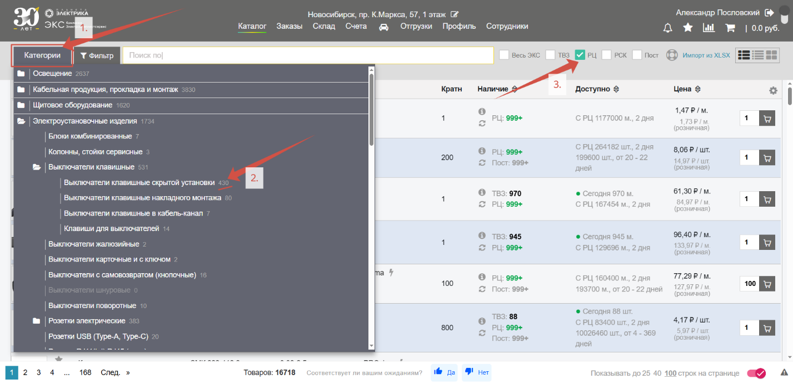
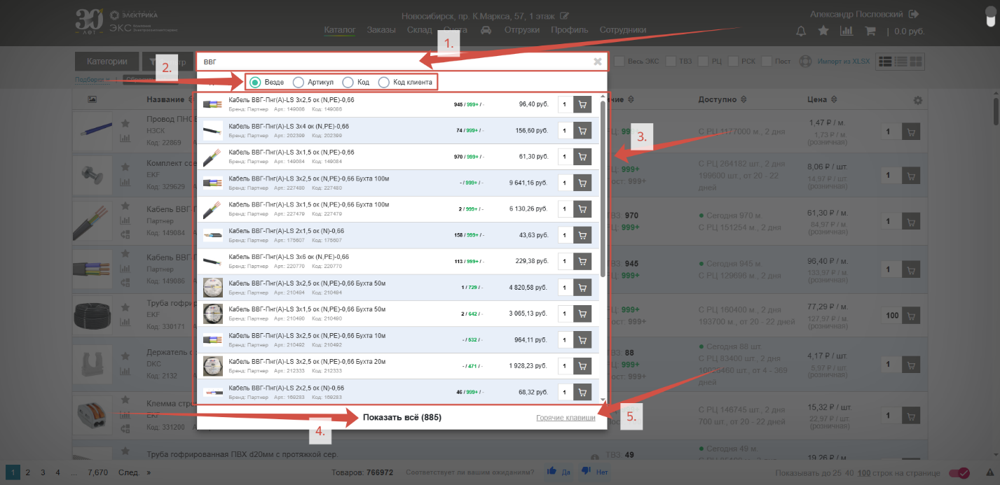
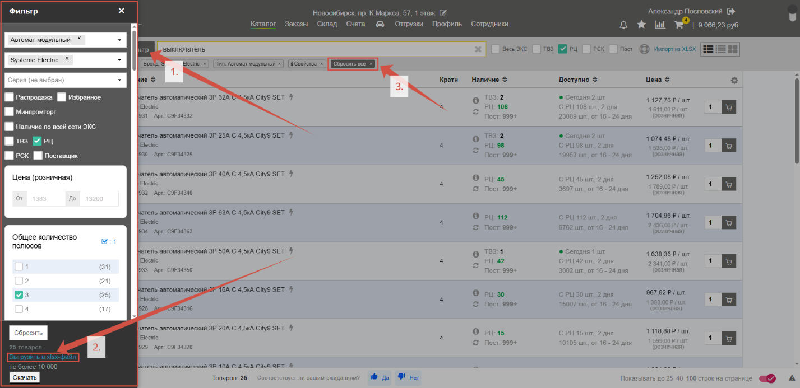

## Категории

Существует несколько способов найти необходимый товар. Один из них – через кнопку «**Категории**» (*1.*). При нажатии откроется дерево сайта со всеми представленными категориями товаров. Справа от названий указано сколько товаров (*2.*) в категории соответствуют заданным условиям и свойствами (*3.*):

## Поисковая строка

Самый простой и популярный способ найти товар – вбить его название или артикул **в поисковую строку** (*1.*). Для более точных результатов выберите по какому признаку ищите (*2.*). Система сразу выдаст **быстрые результаты поиска** (*3.*), отсюда, при нажатии на товар, можно посмотреть детальную информацию о нем, или сразу указать необходимое количество и добавить в корзину. Чтобы просмотреть все результаты нажмите «**Показать все**» (*4.*) или кнопку **Enter**. Работать с результатами поиска можно прямо с клавиатуры, для подробной информации с описанием клавиш наведите на «**Горячие клавиши**» (*5.*): 

## Фильтр

Получив некоторый крупный список товаров, правильным решением будет сузить его. Для этого нажмите кнопку «**Фильтр**» (*1.*). Здесь можно уточнить тип товара, нужные бренды, ценовой диапазон, наличие и другие технические характеристики. Если вам необходимо получить табличный файл со сведениями о перечне товаров по заданным характеристикам, нажмите «**Выгрузить в xlsx-файл**» (*2.*). Когда заданные параметры будут больше не нужны, нажмите на кнопку «**Сбросить все**» под поисковой строкой (*3.*):

