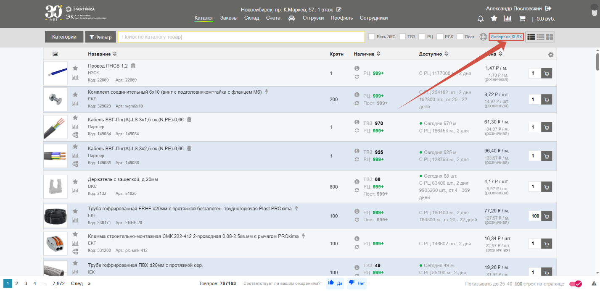
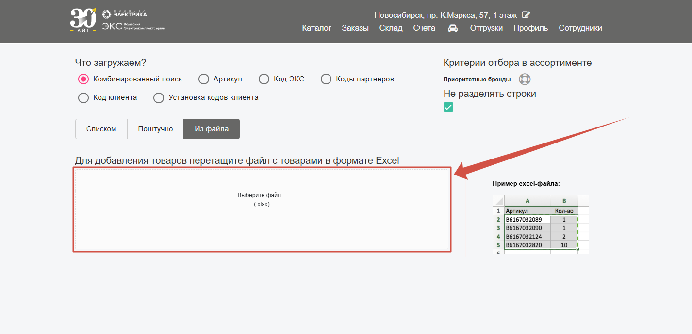
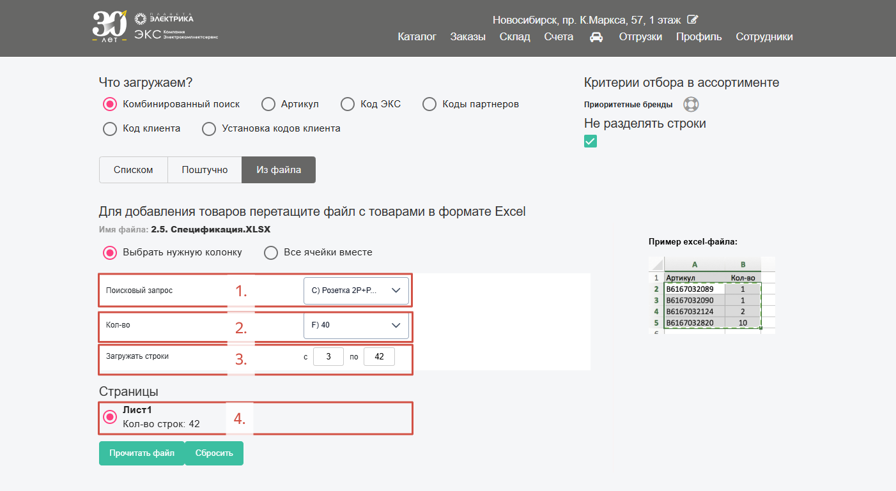
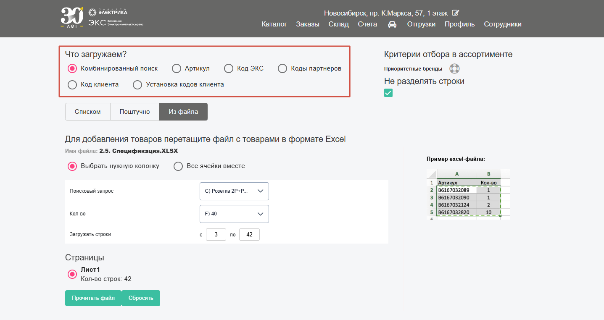
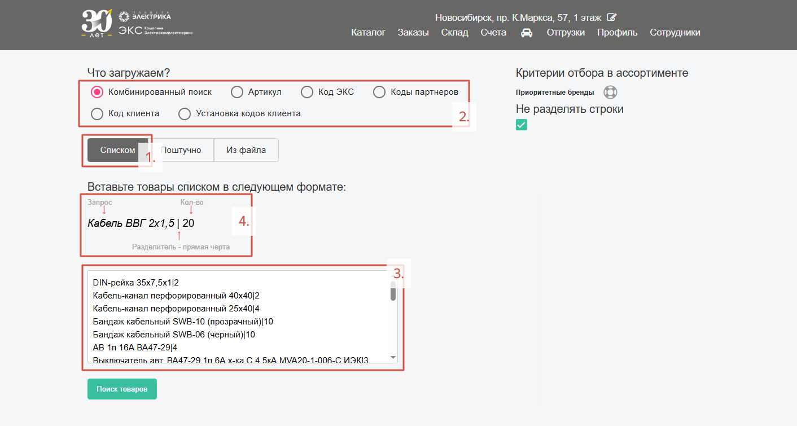
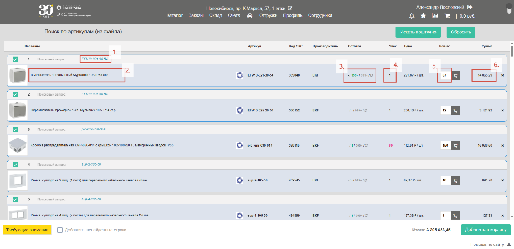
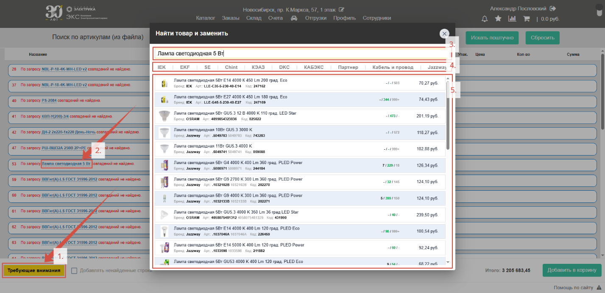
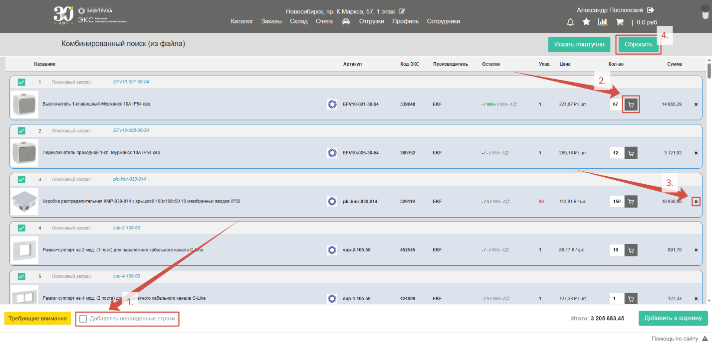

На сайте реализован функционал, позволяющий проводить **поиск сразу по множеству позиций или даже готовой спецификации**. Наши менеджеры, когда получают от клиентов крупную спецификацию, первым делом заходят туда – а сейчас, мы предлагаем эту функцию и нашим клиентам. 
Для начала работы нажмите кнопку «**Импорт из XLSX**»:

## Заливка из файла Excel

В открывшейся форме перетащите файл формата **Excel в выделенную область** или нажмите не нее и выберите нужный файл: 

В идеале, таблицу следует сократить до 2 столбцов – **наименование/артикул и количество**, но даже если файл содержит и другую информацию, достаточно **выбрать нужные колонки и указать необходимый диапазон строк**: 

1.  **Поисковый запрос** – столбик с тем что ищем (наименование или артикул);
2.  **Кол-во** – количество необходимого товара (без единиц измерения);
3.  **Загружать строки** – диапазон строк, с какой по какую ищем;
4.  **Страницы** – выбрать лист, на котором в файле находится нужная информация.

Выберите **способ поиска**, от этого будет зависеть точность и скорость подбора:

1.  **Комбинированный поиск** – выбирайте если ищите по наименованию товара. Система будет искать соответствие по всей товарной базе и базе синонимов, поэтому поиск займет больше времени чем другие варианты, но предложит альтернативы для товаров;
2.  **Артикул** – выбирайте если ищите по артикулу товара. Работает очень быстро и точно;
3.  **Код ЭКС** – поиск по кодам товаров нашей сети;
4.  **Коды партнеров** – на текущий момент мы активно развиваем поиск на сайте по кодам наших партнеров по рынку; 
5.  **Код клиента** – на сайте есть возможность задать товарам свои индивидуальные коды. Этот способ произведет поиск по ним;
6.  **Установка кодов клиента** – возможность массово задать индивидуальные коды клиента группе товаров.

## Заливка списком

Заливка списком позволяет производить **массовый поиск по скопированному тексту**. Копируйте текст из спецификаций, мессенджеров и других источников, вставляйте в специальную область и производите подбор сразу по нескольким позициям. Зачастую это быстрее и эффективнее чем искать каждый товар поштучно.
Для начала выберите способ «**Списком**» (*1.*). Выберите **вариант поиска** (*2.*). **Вставьте** скопированный текст в специальное поле (*3.*), обращайте внимание на **необходимый формат** (*4.*), от этого будет зависеть точность распознавания запроса и результаты поиска:   

## Результаты поиска

После нажатия на кнопки «**Поиск товаров**» или «**Прочитать файл**» и подтверждения корректности введенных данных начнется процедура поиска. Итогом процедуры будет список из позиций, подходящих под введенный запрос:

1.  **Поисковый запрос** – то, по какому запросу производился поиск. Нажатие на запрос выведет список позиций, которые по мнению системы могут быть похожими на то, что вы искали. Из этой формы вы можете выбрать другой подходящий вариант или отредактировать поисковый запрос;
2.  **Результаты поиска** – то, что нашлось по запросу;
3.  **Остатки товара** – текущие наличие товара на складах;
4.  **Кратность упаковки** – количество товара в упаковке;
5.  **Количество товара** – необходимое количество товара, согласно запросу;
6.  **Сумма** – стоимость товаров с учетом вашей скидки.

Бывает, что товар найти не удалось. В этом случае под списком появляется кнопка «**Требующие внимания**» (*1.*) – нажатие на кнопку выведет те **позиции, которые найти не удалось**. Нажмите на поисковый запрос (*2.*). Откроется форма, в которой запрос можно откорректировать (*3.*), выбрать конкретный бренд (*4.*) и подобрать подходящий вариант (*5.*): 

В случае, если подходящую замену **подобрать** все-таки **не удалось**, нажмите галочку рядом с «**Добавлять ненайденные строки**» (*1.*) – **позиции все равно добавятся к заказу**, менеджер свяжется с вами для уточнения информации.

Результаты поиска сохраняться даже если вы перейдете в другой раздел сайта, еще раз нажмите «**Импорт из XLSX**» чтобы вернуться к списку. Рекомендуется построчно проверять результаты и добавлять каждую позицию отдельно, чтобы минимизировать риск ошибки (*2.*). Удалите неактуальную позицию нажатием «**Крестика**» (*3.*) либо сбросьте список целиком (*4.*):

