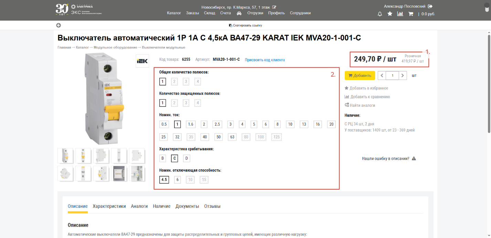
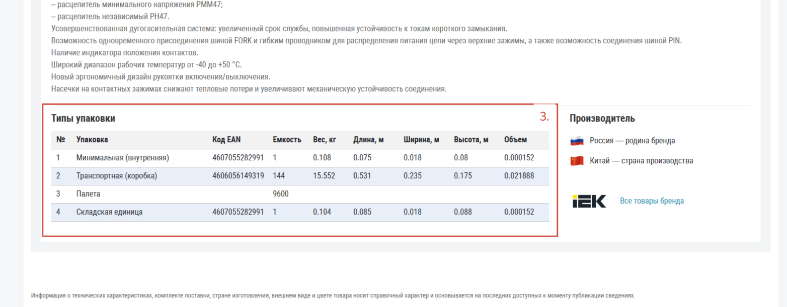
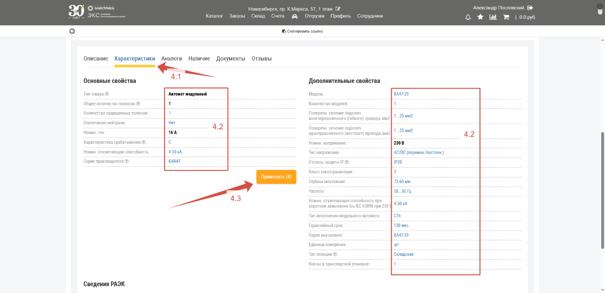
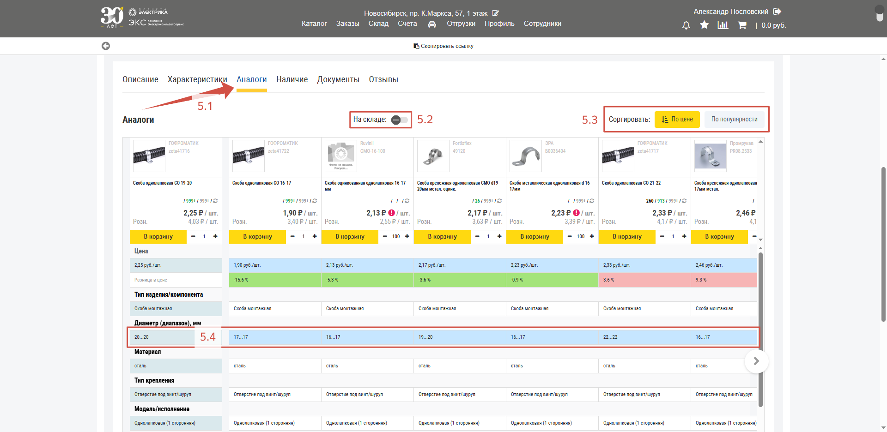
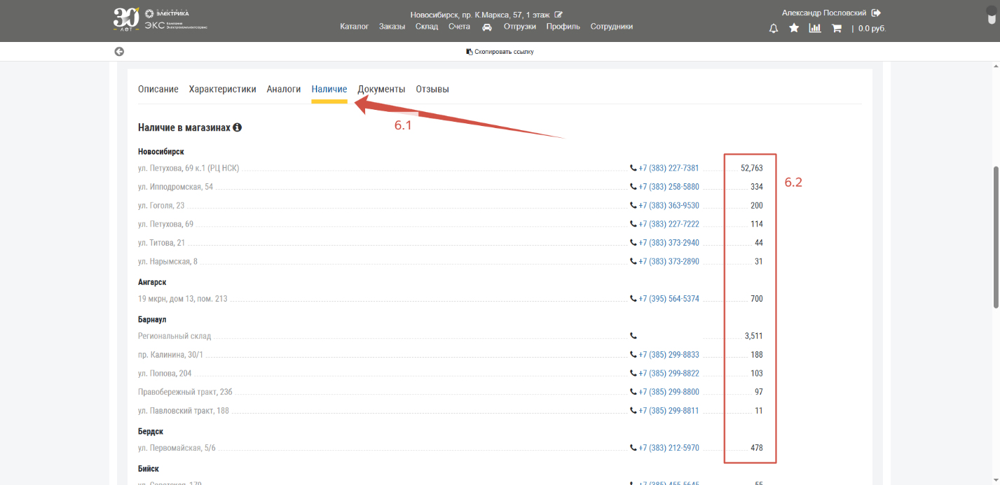
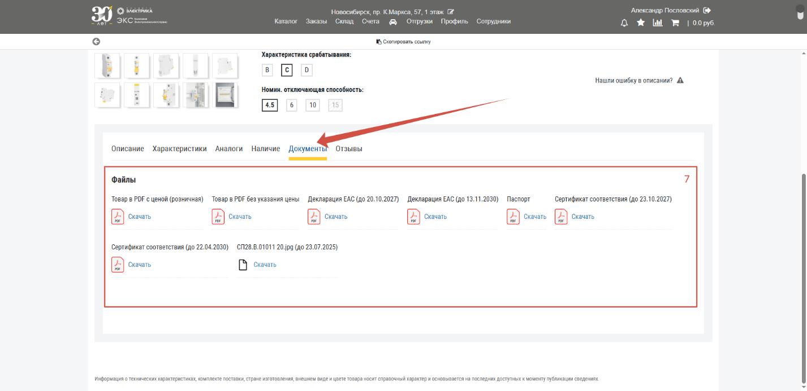
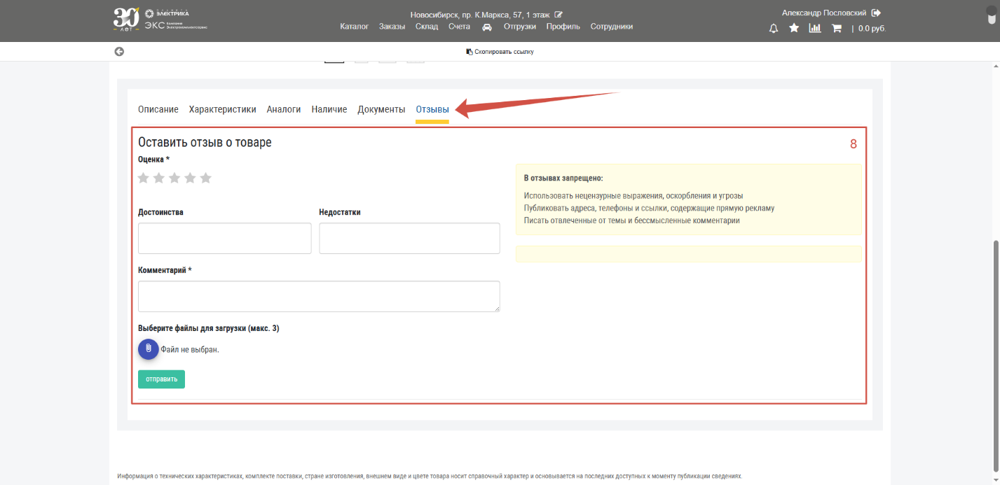

На карточке товара в ЭКС.Бизнес помимо классических функций интернет магазина есть ряд особенностей, которые будут описаны в этом разделе.

## Цена товара

**Цена товара** (*1.*) – крупным размером указана ваша персональная цена с учетом скидок и индивидуальных предложений;

## Основные характеристики

**Основные характеристики** (*2.*) – значения характеристик справа от фотографий товара являются динамическими, это значит, что их можно менять и сразу переходить на другой товар от того же производителя;

## Типы упаковки

**Типы упаковки** (*3.*) – габариты упаковок, в которых поставляется товар;

## Характеристики

**Характеристики** (*4.*) – параметры товара которые находятся на вкладке «**Характеристики**» (*4.1*) можно **выбирать** (*4.2*). После этого появится кнопка «**Применить**» (*4.3*) нажав на которую, откроется **список, [отфильтрованный](/content/04-search/product-finding.qmd#фильтр)  по заданным характеристикам**:

## Аналоги

**Аналоги** (*5.*)– на вкладке «**Аналоги**» (*5.1*) представлен **список аналогичных позиций** в виде сравнительной таблицы. Здесь можно просматривать только те товары, которые **есть в наличии** (*5.2*) и сортировать список **по цене или популярности** (*5.3*). Цветом выделены **отличающиеся характеристики** (*5.4*):

## Наличие

**Наличие** (*6.*)– на вкладке «**Наличие**» (*6.1*) представлена **информация по остаткам** (*6.2*) этого товара на каждом складе и в магазине сети:  

## Документы

**Документы** (*7.*) – **документация товара**, такая как технические паспорта, сертификаты, отказные письма и прочее, представлена на вкладке «**Документы**». Эти приложения обновляются ежедневно из реестра **РАЭК**:

## Отзывы

**Отзывы** (*8.*)– на вкладке «**Отзывы**» есть возможность поделиться своим мнением о товаре: 

