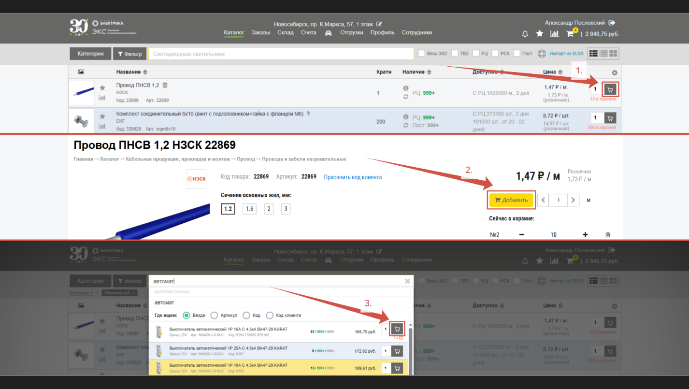
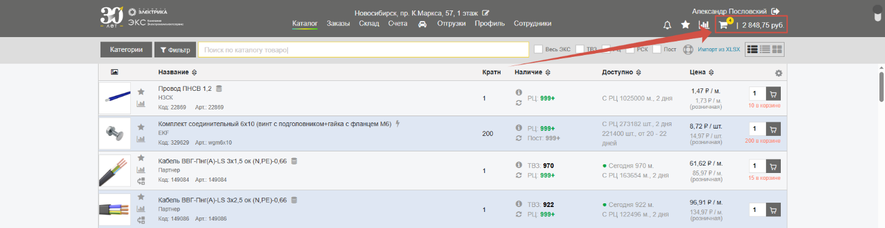
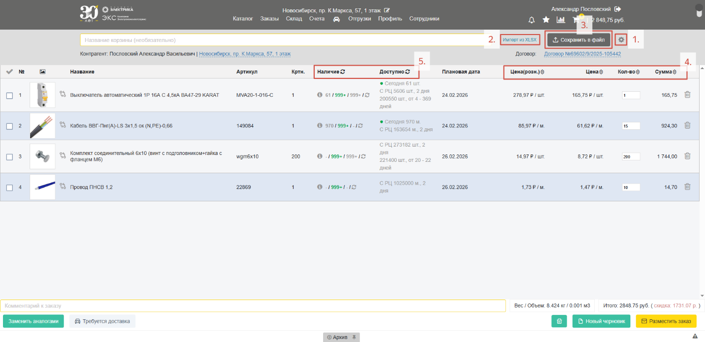
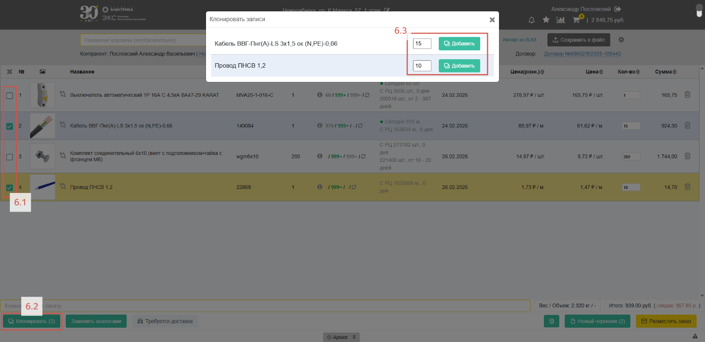
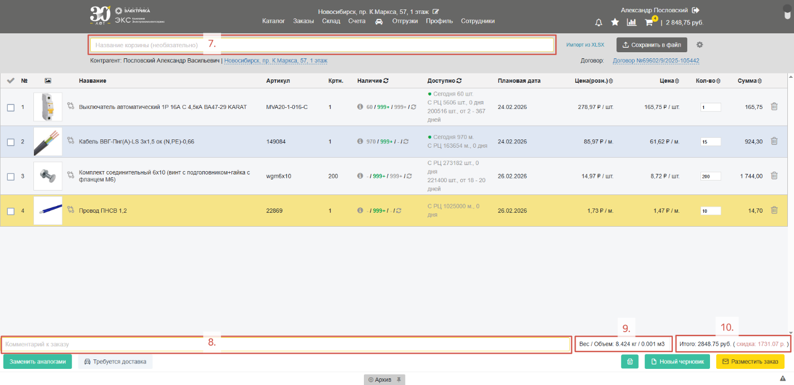
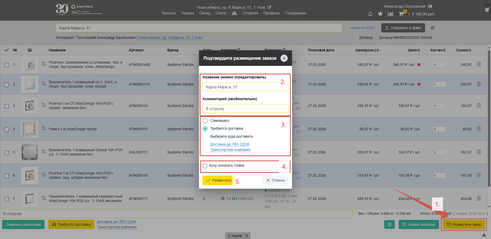

## Корзина

Для того, чтобы приобрести товар в ЭКС.Бизнес его необходимо **добавить в корзину**. Сделать это можно в **списке товаров** (*1.*), **карточке товара** (*2.*) или из **быстрых поисковых результатов** (*3.*). Там же, можно указать необходимое количество товара:

После добавления товара в корзину, у иконки «**Корзина**» в верхней панели сайта появится число, обозначающее **количество позиций** в корзине, и **сумма заказа**:

При нажатии на иконку «**Корзина**» откроется страница корзины. Разберем функциональные элементы: 

1.	«**Шестеренка**» – как и в случае с [табличным представлением](/content/01-workspace/setup-workspace.qmd#представления-товаров) позволяет выводить, скрывать и перемещать колонки с информацией по товарам;

2.	«**Импорт из XLSX**» – открывает форму [шаблонной заливки](/content/05-import/mass-fill-search-template.qmd);

3.	«**Сохранить в файл**» – позволяет сохранить текущий набор товаров в корзине в виде спецификации в Excel или PDF;

4.	«**Сортировка**» – для сортировки позиций в заказе по возрастанию или убыванию нажмите на треугольники справа от названия столбца. Для произвольного упорядочивания наведитесь на изображение товара, курсор изменится на иконку со стрелочками – после этого позицию можно перемещать в произвольное место;

5.	«**Обновление наличия**» – иконка вращающихся стрелок справа от названий колонок позволяет обновить наличие по всем позициям в заказе. Рекомендуется использовать ее перед оформлением заказа для получения наиболее актуальной информации по остаткам; 

6.	«**Выделение**» – нажатие на квадраты в левом столбце выделяет конкретные позиции. Нажатие галочки в названии столбца выделит все позиции. С выбранными позициями можно производить действия – **клонирование, замена аналогами, удаление**:

**Клонирование** – в ряде случаев бывает необходимость создать несколько одинаковых позиций в одном заказе, например, если нужно несколько отрезков одного кабеля. Для этого **выделите** нужные товары (*6.1*), нажмите кнопку «**Клонировать**» (*6.2*), укажите необходимое **количество товара** и нажмите «**Добавить**» (*6.3*):

7.	**Название корзины** – наименование для вашего заказа или спецификации. **Менеджер ЭКС не видит** этой информации, здесь обычно указывается название объекта, адрес, или контактное лицо – все то, что поможет вам самостоятельно найти свой заказ в дальнейшем;

8.	**Комментарий к заказу** – средство коммуникации с вашим менеджером, здесь указывается то, что **менеджер ЭКС увидит** – это могут быть пожелания к заказу, подтверждение отгрузки, просьба выставить КП и т.д. Это сообщение приходит вашему менеджеру в момент оформления заказа;

9.	**Вес / Объем** – ориентировочные габариты заказа; 

10.	**Итого** – итоговая стоимость товаров с учетом скидки;

## Размещение заказа

Для оформления заказа нажмите кнопку «**Разместить заказ**» (*1.*). В открывшейся форме подтверждения перепроверьте **название заказа и комментарий** к нему (*2.*). Выберите **способ доставки**: самовывоз или доставку (*3.*).

У частных лиц есть возможность доставки до ПВЗ СДЭК, у юридических лиц – только доставка транспортной компанией. В случае доставки укажите нужный адрес – после оформления заказа с вами свяжется менеджер чтобы обсудить детали. 

У частных лиц также есть возможность оплатить заказ онлайн с помощью банковской карты (*4.*) Подтвердите размещение заказа (*5.*):

