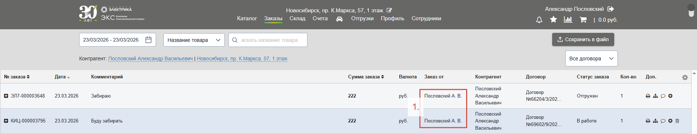
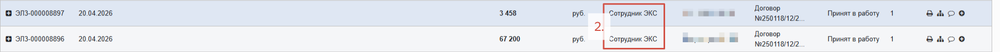
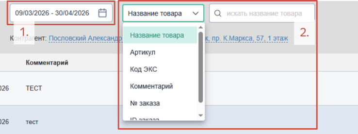
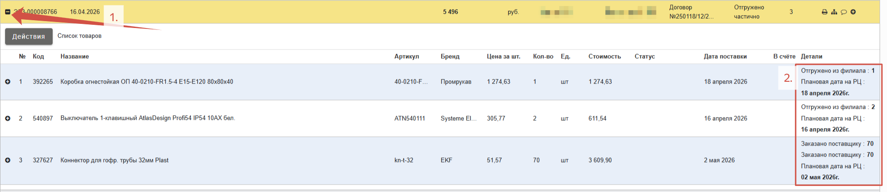
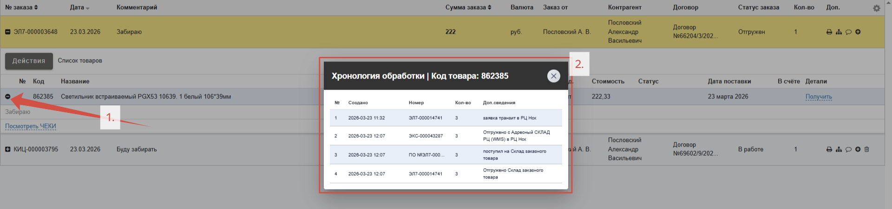

Сразу после оформления заказа менеджеру приходит уведомление, и он берет его в работу. Среднее время реагирования на заказ с сайта не превышает 10 минут. По мере необходимости менеджер связывается с клиентом для подтверждения заказа и уточнения подробностей. 

На вкладке «**Заказы**» хранятся все заказы клиента, включая те, что **клиент оформляет самостоятельно** (*1.*) и те, которые **сотрудники ЭКС оформляют для него** (*2.*):

## Поиск заказа

Если необходимо найти конкретный заказ воспользуйтесь **Календарем** (*1.*) для поиска по дате, либо **поиском по заданному критерию** (*2.*), например, по артикулу товара из заказа или оставленному комментарию: 

## Детали заказа

Получить **подробности** по заказу можно нажав на кнопку «**+**» (*1.*) слева от номера заказа. Раскроется список товаров с информацией по каждой позиции. **Статус товара** (*2.*), что отгрузилось и в каком количестве, отражен в колонке **Детали**:

Кнопка «**+**» (*1.*) слева от каждой позиции в заказе позволяет просмотреть **всю хронологию обработки** конкретного товара (*2.*):

