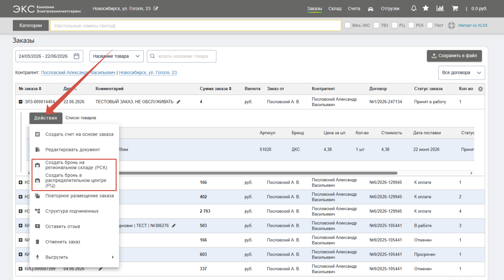
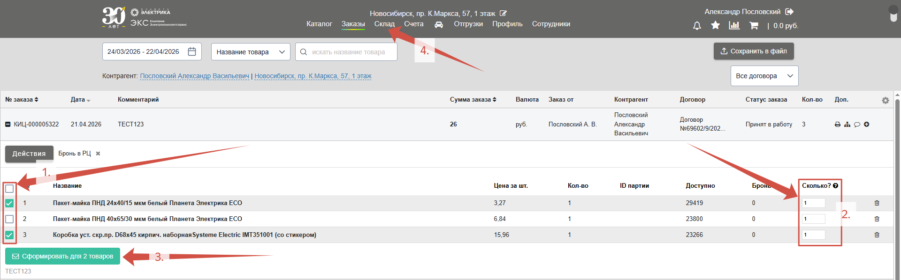
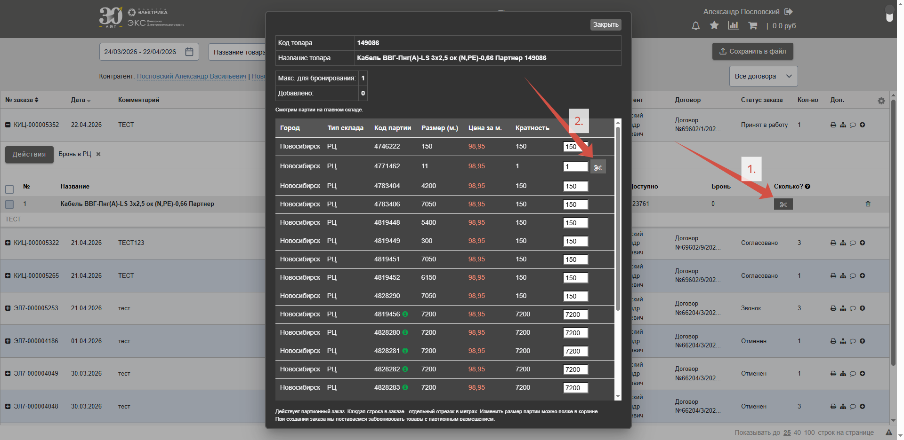
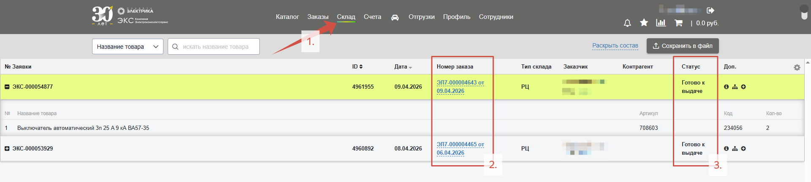

Сервис **ЭКС.Бизнес** позволяет клиентам самостоятельно резервировать товары. Бронь держится **3 календарных дня** и в это время отложенное количество единиц недоступно ни для покупки на сайте, ни для менеджеров в нашей учетной системе. Это время позволяет клиенту, например, передать счет в бухгалтерию и не переживать о том, что за время согласования необходимый товар разберут. По истечении срока бронь автоматически завершается и товар попадает в свободный остаток. Брони, которые создает менеджер клиента могут держаться дольше. Для самостоятельного бронирования товаров необходимо чтобы у контрагента был **положительный кредитный баланс, не имелось задолженностей по платежам и товар был в наличии на складе**. 

## Создание брони

Бронирование товаров доступно после [размещения заказа](/content/07-cart/order-placement.qmd#размещение-заказа). Раскройте состав размещенного заказа и нажмите кнопку [**Действия**](/content/18-action-button/action-button.qmd). В зависимости от закрепленного филиала выберите один из вариантов: 

- **Создать бронь на региональном складе (РСК)** – Позволяет самостоятельно забронировать товар на региональном складе для клиентов, закрепленных в филиалах **Красноярска, Иркутска, Кемерово и Барнаула**.  
  
- **Создать бронь в распределительном центре (РЦ)** – Позволяет самостоятельно забронировать товар в распределительном центре (главном складе в Новосибирске) для клиентов, которые закреплены **в Новосибирске и близлежащих филиалах**.

**Выберите товар**, который нужно забронировать (*1.*). **Укажите количество** товара для бронирования (*2.*), это количество не может превышать значения в колонке **Кол-во** (количество товара в заказе) и **Доступно** (количество товара в свободном остатке на складе). Подтвердите бронь нажатием на кнопку **Сформировать для товаров** (*3.*). Сформированные брони храниться на вкладке **Склад** (*4.*).

## Бронирование кабеля

При **бронировании кабеля** подразумевается, что необходимый метраж будет “отрезан” от [доступной партии](/content/03-buttons/useful-buttons.qmd#доступные-партии). Поэтому, для резервирования необходимо нажать кнопку «**Ножницы**» (*1.*) и выбрать подходящую по кратности и остатку партию (отрезок) кабеля – справа от такой партии появится иконка «**Ножницы**» (*2.*). После выбора отрезка закройте окно выбора партии и подтвердите бронирование нажатием на кнопку **Сформировать для товаров**.

## Просмотр бронирований

Зарезервированные товары клиента хранятся на вкладке **Склад**, в том числе, те, которые резервировались в нашей учетной системе менеджером клиента. 

Со страницы **Склад** (*1.*) можно получить информацию о текущих зарезервированных за клиентом товарах. Каждое бронирование закрепляется за соответствующим ему заказом, можно нажать на **номер заказа** (*2.*), чтобы получить подробную информацию о нем. Отслеживайте статус бронирования – в момент, когда заказанные товары будут готовы у выдаче, клиенту должно прийти автоматическое сообщение и статус изменится на соответствующий (*3.*):

