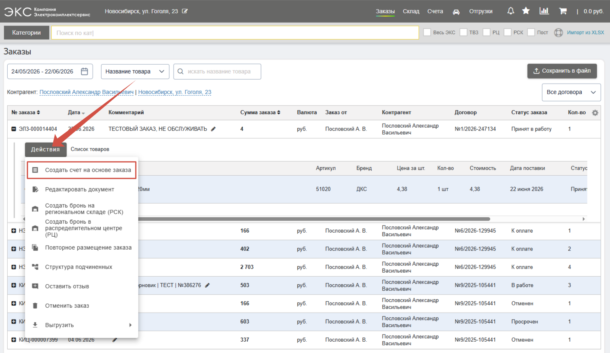
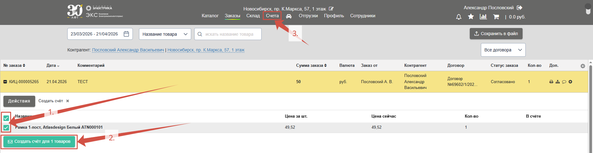
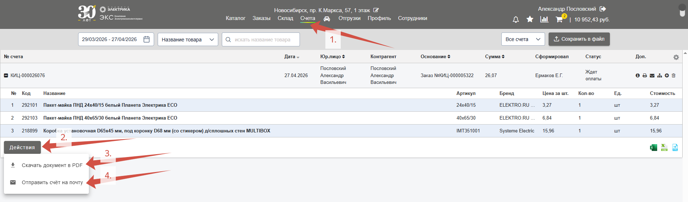

## Самостоятельное выставление счета

Сервис **ЭКС.Бизнес** позволяет клиентам самостоятельно, без привелечения менеджера, выставлять счета по своим заказам. Полученный счет обладает теми же реквизитами, которые бы клиенту выдал его менеджер. 

Раскройте состав заказа и нажмите кнопку [**Действия**](/content/18-action-button/action-button.qmd), в меню выберите пункт **Создать счет на основе заказа**.

При выставлении себе счета можно выбрать конкретные позиции для оплаты, для этого **выберите нужные товары** (или нажмите чекбокс рядом с колонкой Название чтобы выбрать все позиции) (*1.*). Далее нажмите на кнопку **Создать счет для товаров** (*2.*).  Выставленные счета клиента хранятся на вкладке **Счета** в верхнем меню сайта (*3.*):

## Взаимодействие со счетом

В случае, если клиент не работает по договору отсрочки, сборка заказа осуществляется только после получения средств на расчетный счет. 

Сформированные счета хранятся на вкладке **Счета** (*1.*). Нажав на кнопку **Действия** (*2.*) можно **скачать счет** в формате PDF (*3.*) либо **отправить на** любую указанную **почту** (*4.*): 

