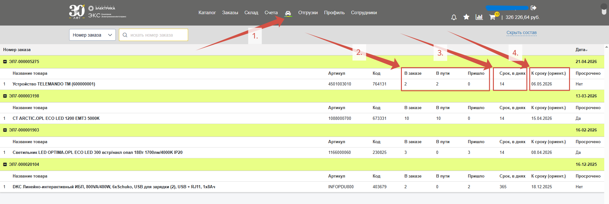

Вкладка **товарное движение** (*1.*) предоставляет информацию по заказным позициям, которые находятся в пути от поставщика. Здесь находится информация о том, **сколько единиц товара пришло** (*2.*), ориентировочные **сроки поставки** от поставщика (*3.*) и ориентировочная **дата поступления** (*4.*): 

