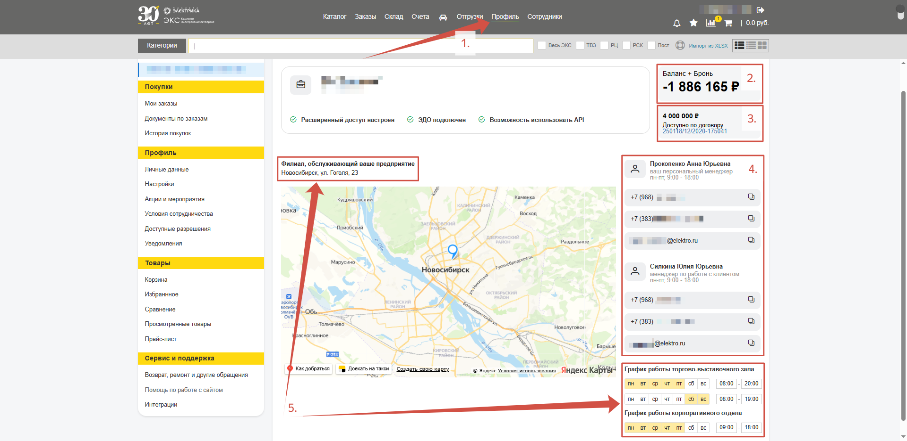
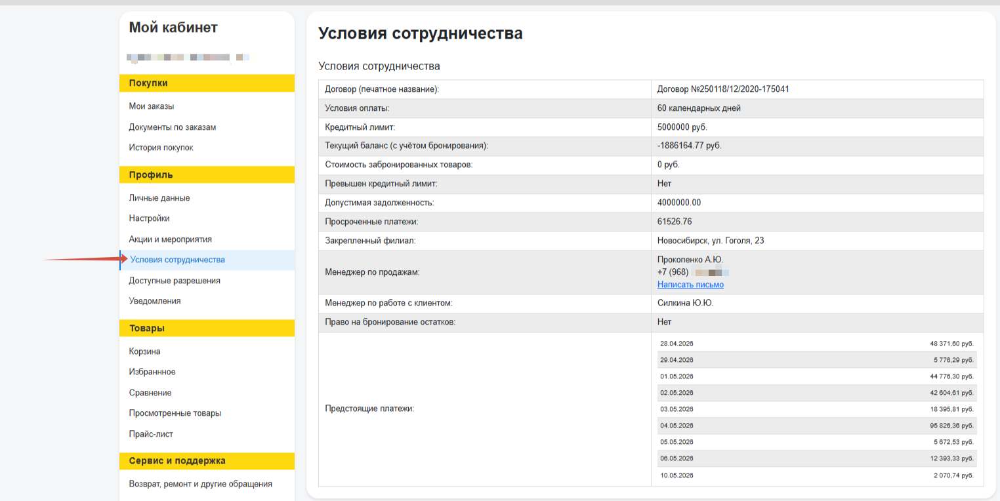
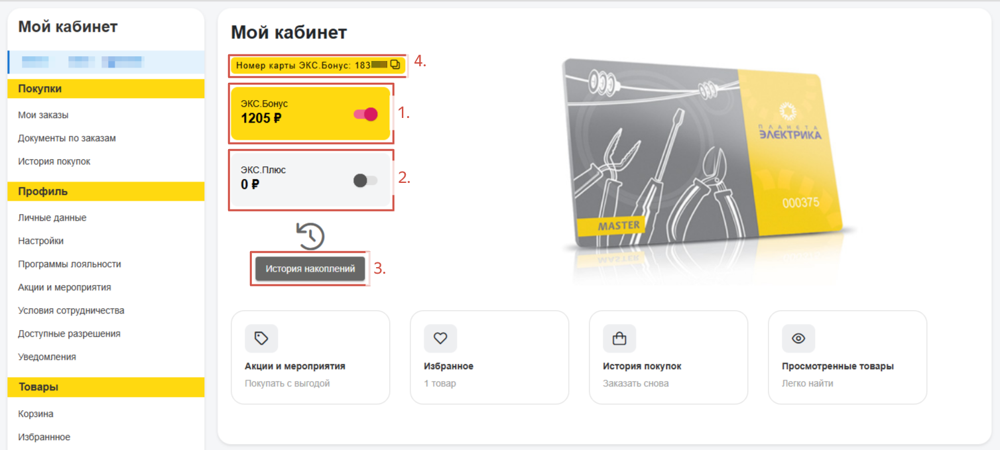
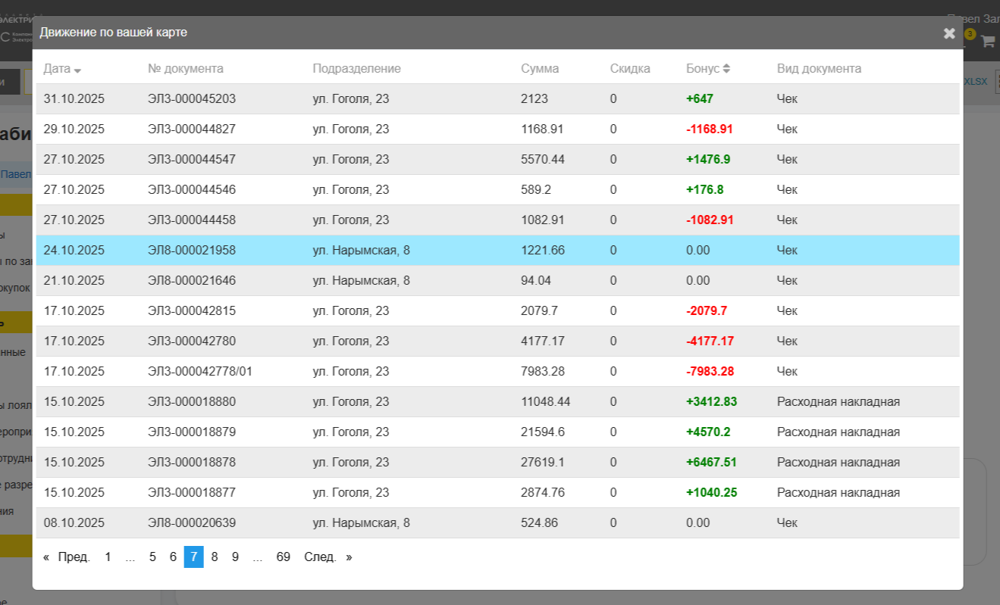
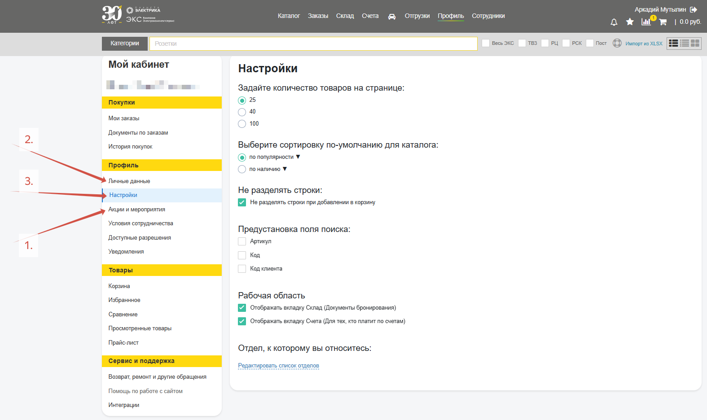

## Профиль юридического лица

На главной странице вкладки **Профиль** (*1.*) хранится персональная информация о клиенте.

У **юридического лица** это: **текущий баланс** (*2.*), **доступный лимит** по договору (*3.*), **контакты** персональных менеджеров (*4.*) и информация о закрепленном **филиале** (*5.*): 

Вкладка **Условия сотрудничества** позволяет получить детальную информацию о статусе текущего договора между клиентом и ЭКС, в частности информацию об условиях оплаты, доступном кредитном лимите, текущем балансе и графике предстоящих платежей:

## Профиль частного лица

У **частного лица (электрика)** на странице Профиль содержится информация о балансе подключенных накопительных систем **ЭКС.Бонус** (*1.*) и **ЭКС.Плюс** (*2.*), **история накоплений** (*3.*) и **номер накопительной карты** (*4.*), который используется на кассах в розничных магазинах: 

**История накоплений** позволяет отслеживать зачисления и списания по бонусной карте: 

## Дополнительная информация

Панель слева позволяет переключаться между страницами с дополнительной информацией и персональными настройками. Таким образом можно получить информацию об **активных акциях** (*1.*), **отредактировать личные данные** (*2.*) или провести более **глубокие настройки каталога** товаров (*3.*): 

