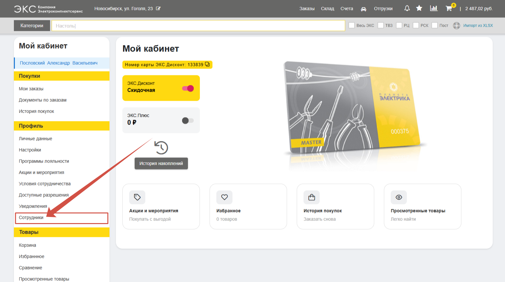
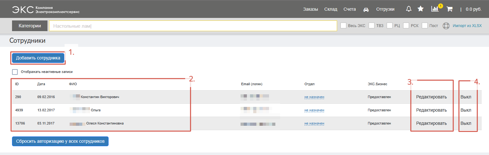
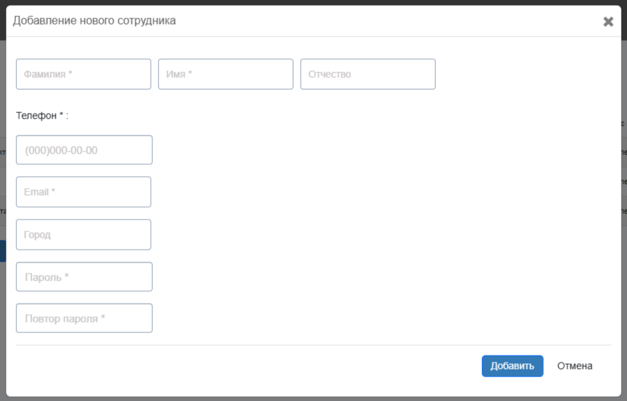
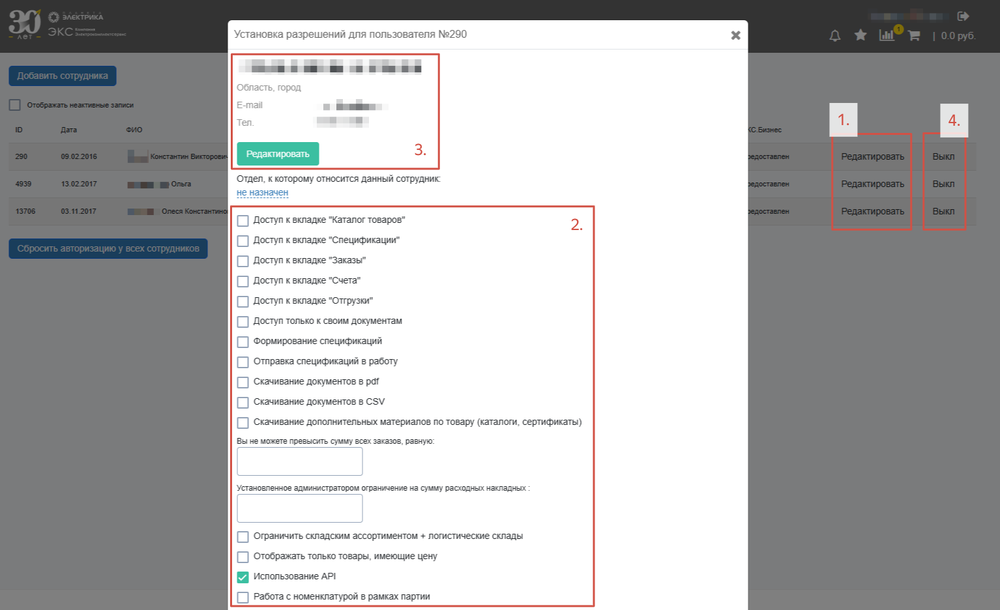

По умолчанию, у администратора компании клиента есть возможность самостоятельно, без участия менеджера со стороны ЭКС, подключать дополнительные личные кабинеты сотрудников. 

Для этого на странице [**Профиль**](/content/13-profile/profile.qmd) перейдите во вкладку **Сотрудники**:

На вкладке представлен **список** подключенных к ЭКС.Бизнес **сотрудников** (*2.*). Для добавления нового сотрудника нажмите кнопку **Добавить сотрудника** (*1.*). Администратор компании также может **управлять разрешениями** каждого сотрудника, управляя доступом до различных функций сайта (*3.*). Для отключения сотрудника нажмите кнопку **Выкл** (*4.*):

После заполнения полей в **форме** и нажатия на кнопку «**Добавить**» новому сотруднику придет автоматическое письмо на указанную почту с ссылкой на дальнейшее подключение:

Администратор компании может для каждого сотрудника выдать индивидуальный набор разрешений и доступов. Для этого нажмите **Редактировать** (*1.*) и задайте необходимые **настройки** (*2.*). Для корректировки **контактных данных** нажмите кнопку **Редактировать** (*3.*) в открывшемся окне. Покинувших компанию сотрудников можно самостоятельно отключить нажав кнопку **Выкл** (*4.*): 

