## Как сменить контрагента?

Юридические лица могут переключаться между контрагентами в случае если у них зарегистрировано несколько компаний, и они объединены в холдинг. Для этого в **Корзине** (*1.*) нажмите на **название контрагента** (*2.*), в открывшемся окне **выберите необходимый** (*3.*):

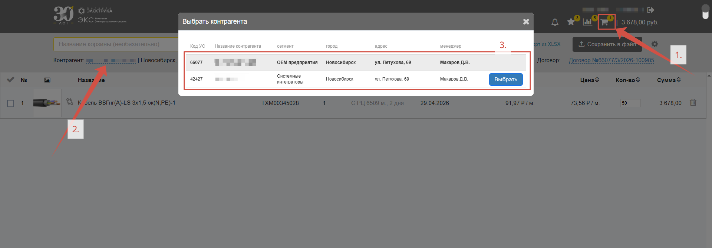

## Как сменить договор?

В **Корзине** (*1.*) нажмите на **наименование договора** (*2.*) и выберите необходимый (*3.*):

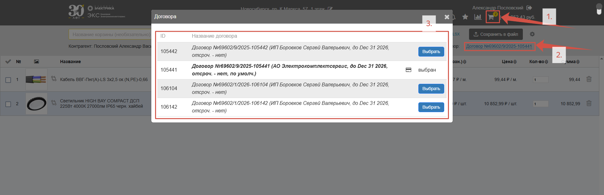

## Как скопировать наименование/артикул/цену товара?

Для копирования артикула, кода товара на сайте, цены или бренда не обязательно их выделять, достаточно просто на них нажать – в нижнем правом углу появится сообщение **Скопировано в буфер**, после этого информацию можно вставлять куда необходимо:

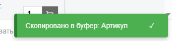

Так как при нажатии на наименование откроется страница товара, необходимо навестись на наименование – справа появится иконка **Копировать**, нажмите на нее чтобы скопировать название: 

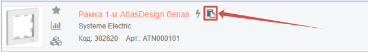

## Мой заказ отгрузился частично, что осталось получить?

В развернутом заказе, в колонке **Детали** представлены статусы по каждой товарной строчке. На некоторых мониторах потребуется листнуть вправо чтобы увидеть дополнительные колонки:

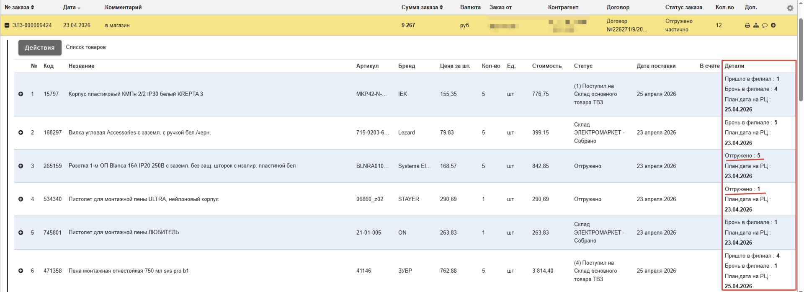

## Какие отрезки кабеля есть в наличии?

Просмотр партий кабельно-проводниковой продукции подробно описан в блоке [Доступные партии](/content/03-buttons/useful-buttons.qmd#доступные-партии).

## Долго грузится список заказов, что делать?

Вероятная причина долгой загрузки страницы **Заказы** – за выбранный интервал дат было размещено большое количество заказов и системе необходимо время, чтобы обработать информацию. Попробуйте конкретизировать либо сократить диапазон дат в **календаре**:

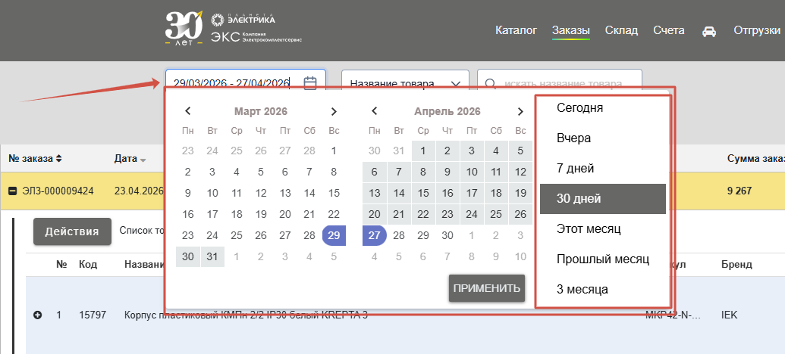

## Как загрузить спецификацию в формате PDF?

На текущий момент ЭКС.Бизнес не предоставляет возможность загружать PDF-файлы или другие, отличные от Excel, форматы в шаблонную заливку. Однако, вы можете отправить такую спецификацию в нейросеть (DeepSeek, ChatGPT, Алиса и т.д.) с запросом (*1.*):

***“подготовь непронумерованный список позиций из наименования / артикула без единиц измерения по формату Кабель ВВГ 2х1,5 | 20”***

Этот способ работает не только с .pdf, но и с изображениями и другими форматами не предусмотренными ЭКС.Бизнес. 
Нейросеть выдаст результат (*2.*), который можно будет загрузить на сайт.

***ВАЖНО ПЕРЕПРОВЕРЯТЬ НАЙДЕННЫЕ НЕЙРОСЕТЬЮ И ШАБЛОННОЙ ЗАЛИВНОЙ РЕЗУЛЬТАТЫ**.

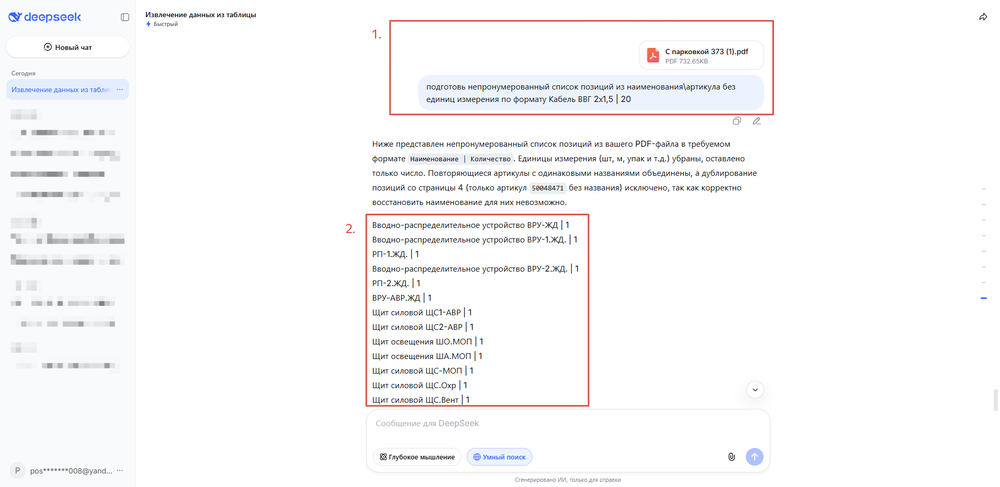

Полученный список товаров можно загрузить в [Шаблонную заливку](/content/05-import/mass-fill-search-template.qmd) методом «**Список**»:

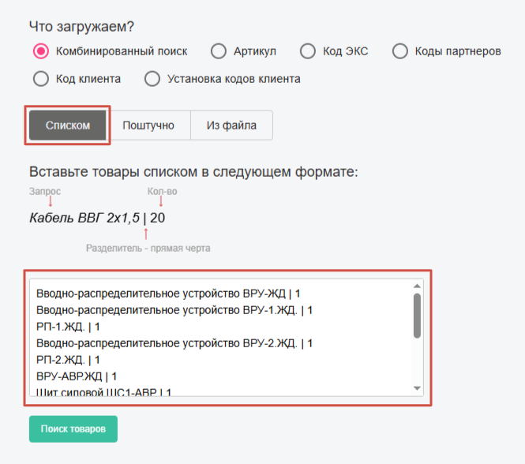

## Мой коллега забыл доступы к сайту, что делать?

Доступ к сайту можно восстановить самостоятельно воспользовавшись функцией Восстановить пароль на форме авторизации. На указанную почту придет письмо с инструкциями: 

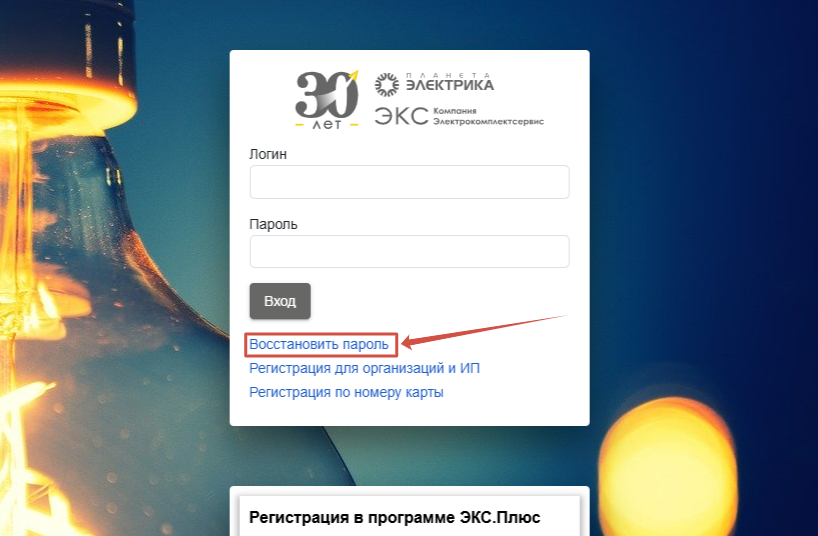

В случае, если вы не помните указанную почту, всегда можно обратиться к вашему менеджеру и восстановить доступ к сайту.

## Я заказал товар на сайте, но менеджер сказал, что его нет в наличии

В фоновом режиме остатки товаров в каталоге обновляются каждые 30 минут. Для того, чтобы получить свежую информацию по остаткам, вы можете нажать кнопку **принудительного обновления остатков** – тогда сайт в реальном времени обратиться к базе данных и отобразит актуальную информацию: 

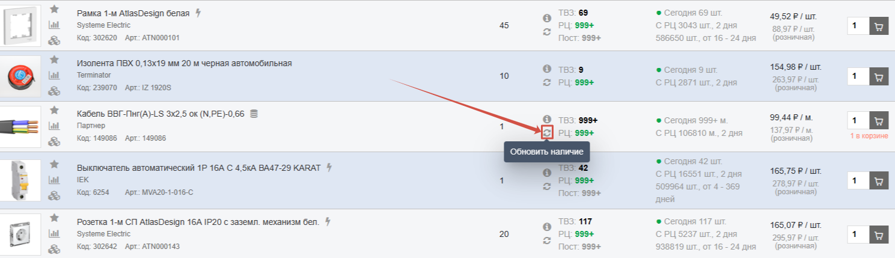

После добавления всего списка товаров в корзину, перед оформлением заказа рекомендуется принудительно обновить наличие по этим товарам. Для этого нажмите иконку **Обновить остатки** в колонке **Наличие** или **Доступно**:

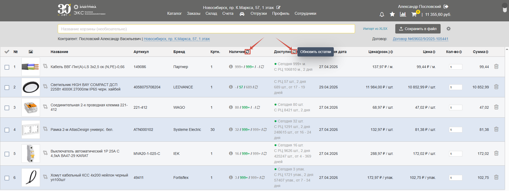

## Как поменять порядок товаров в спецификации?

После добавления товаров к корзину можно изменить их порядок в спецификации. Для этого наведитесь на изображение товара, форма курсора должна принять следующий вид: 

Теперь, при зажатии изображения товара можно переместить его в нужное место. После изменения порядка снизу появится кнопка **Сохранить порядок**. Достаточно нажать на нее или подождать 10 секунд, чтобы новый порядок товаров сохранился: 

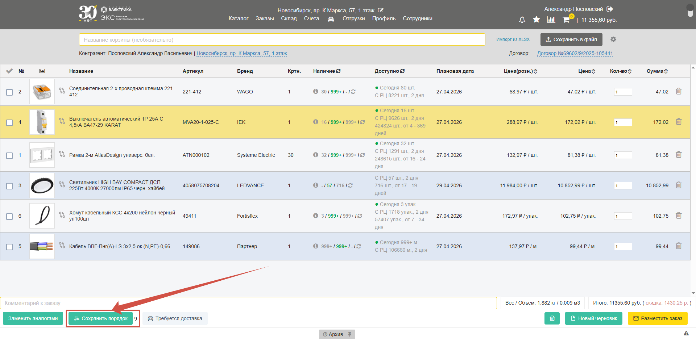

## Как повторить заказ?

Для повторного размещения заказа найдите нужный заказ на вкладке **Заказы** (*1.*), **раскройте** его (*2.*), нажмите кнопку **Действия** (*3.*) и выберите **Повторное размещение заказа** (*4.*). После этого, набор товаров из заказа попадет в корзину.

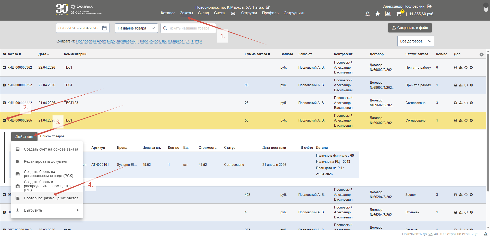

Если есть потребность периодически покупать один и тот же набор товаров, рекомендуется **дать название** (*1.*) такой спецификации и сохранить ее **как черновик** (*2.*): 

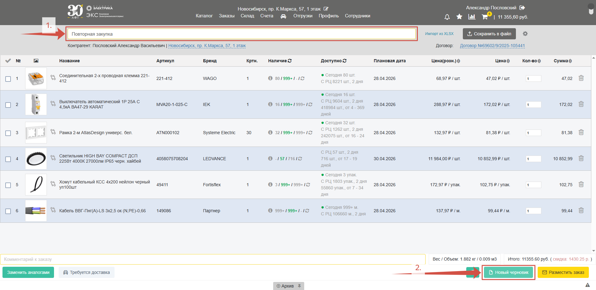

Сохраненные [черновики](/content/16-archive/archive.qmd) хранятся в **Архиве** (*1.*), товары из него можно снова добавить в корзину нажав на «**+**» (*2.*): 

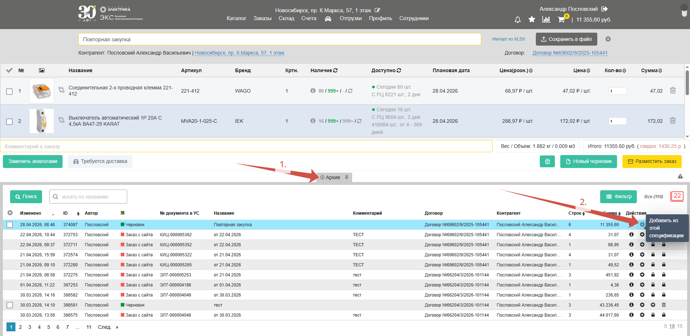

## Как отредактировать персональную информацию?

Зайдите в **Профиль** (*1.*) во вкладку **Личные данные** (*2.*). Для редактирования персональной информации нажмите кнопку **Редактировать** (*3.*). Введите корректировки и **Сохраните изменения**:

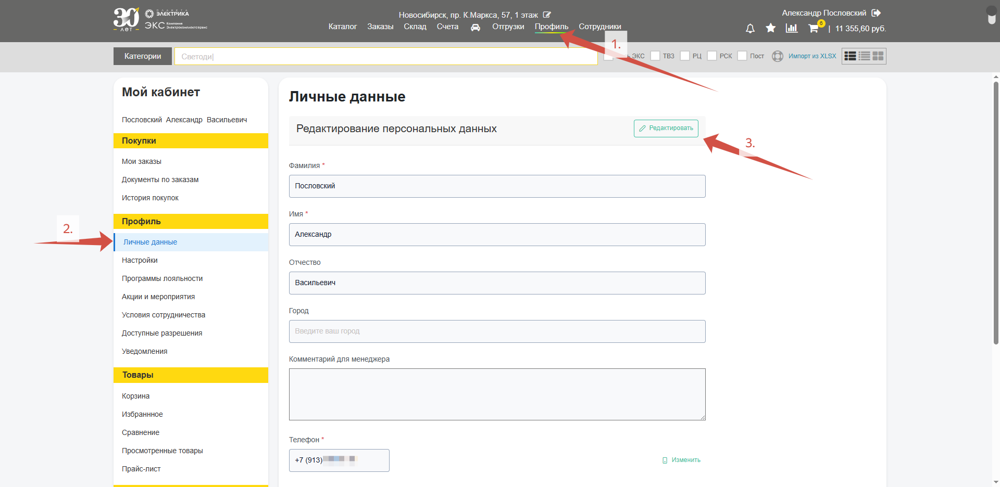

Для редактирования номера телефона нажмите кнопку **Изменить** и пройдите дальнейшие шаги: 

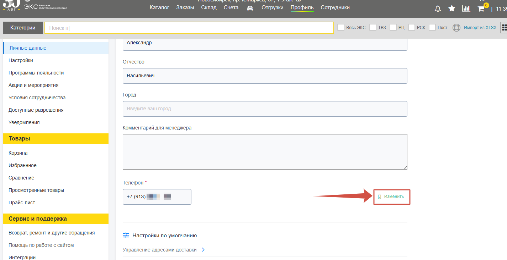

***Самостоятельное редактирование Email в данный момент не предусмотрено, в случае необходимости обратитесь к своему менеджеру***

