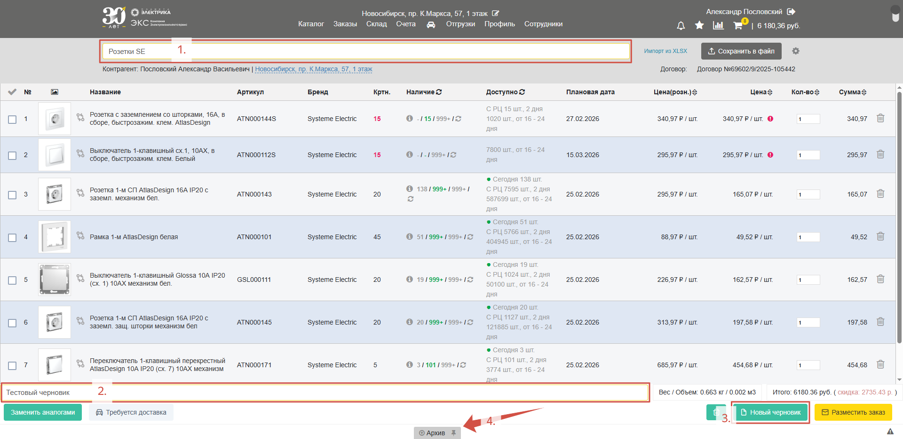
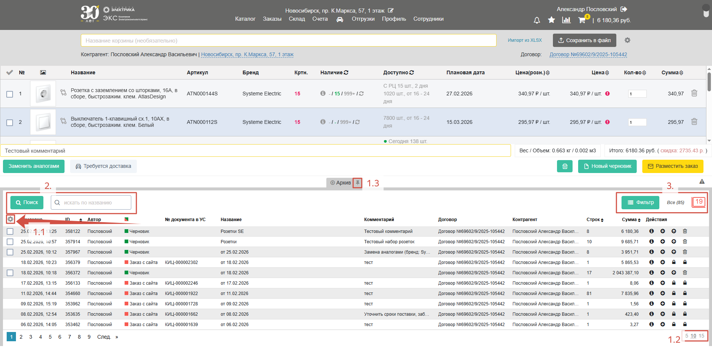
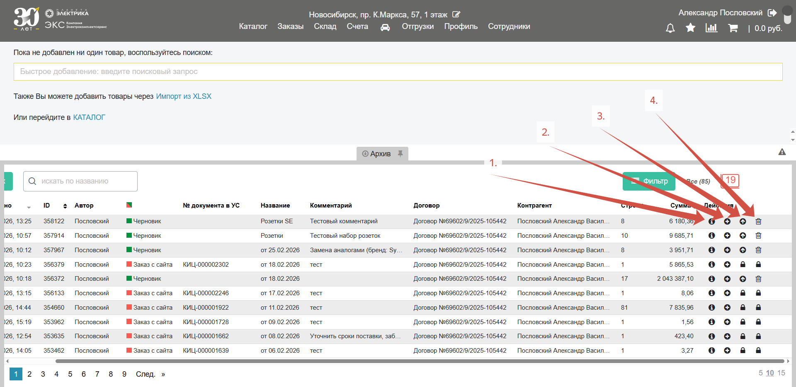
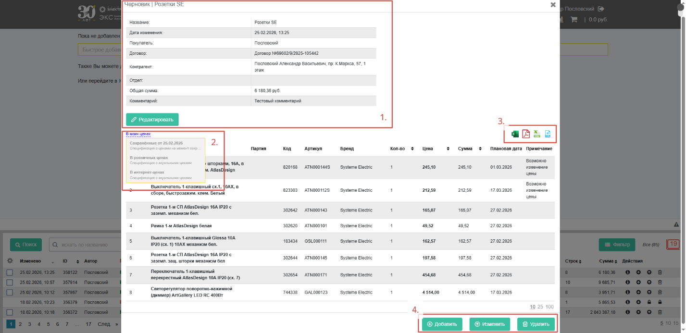

В ЭКС.Бизнес существует система создания черновиков для случаев, когда необходимо сохранить набор товаров без размещения заказа. К черновику можно вернуться в любой момент, дооформить его до полноценного заказа или скачать его как спецификацию. 

Для этого в корзине можете задать название вашему **черновику** (*1.*), чтобы было проще его найти, и оставить **комментарий с дополнительной информацией** (*2.*). Нажмите кнопку «**Новый черновик**» (*3.*) и подтвердите действие. После этого черновик будет сохранен в **Архив** (*4.*):

**Архив** – хранилище ваших заказов с сайта и сохраненных черновиков. Выберите какие данные отображать (*1.1.*), сколько строчек отображать (*1.2*.) и закрепите панель (*1.3*.), если это необходимо. Пользуйтесь **поиском** (*2*.) и **фильтром** (*3*.) для поиска нужного заказа или черновика:

Справа на каждой строчке есть полезные кнопки, которые позволяют **просмотреть** спецификацию (*1.*), **добавить в корзину **товары из спецификации (*2.*) отредактировать спецификацию (*3.*) и **удалить** (*4.*):

Двойное нажатие на черновик или заказ в архиве откроет **детальную информацию**, включающую описание с возможностью его **отредактировать** (*1.*). Под блоком с информацией есть строчка, позволяющая **изменить тип цен** для спецификации (*2.*). Спецификацию с новым типом цен можно **скачать** в различных форматах (*3.*). Кнопки внизу формы позволяют снова **добавить товары** из спецификации в корзину, **отредактировать** их или **удалить** (*4.*):

