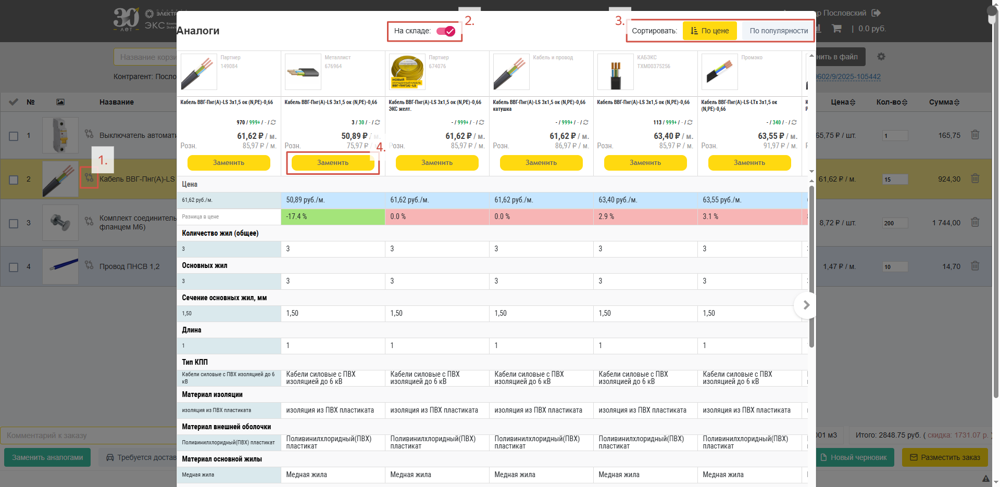
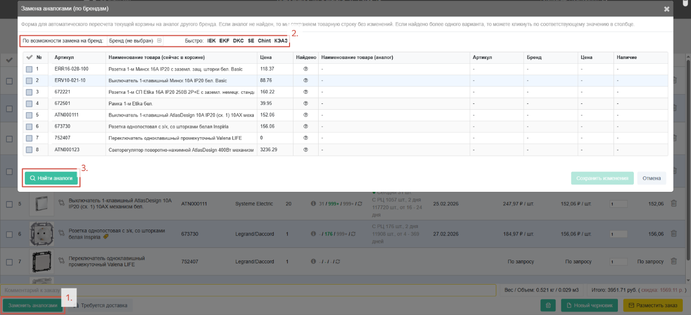
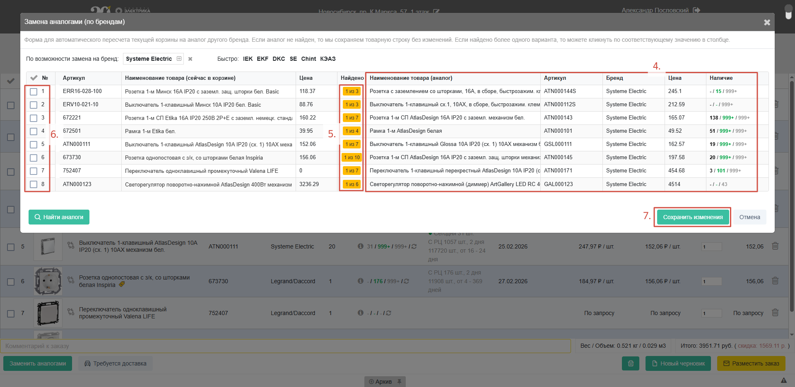
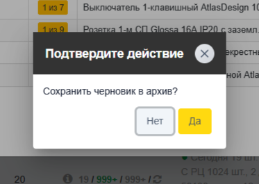
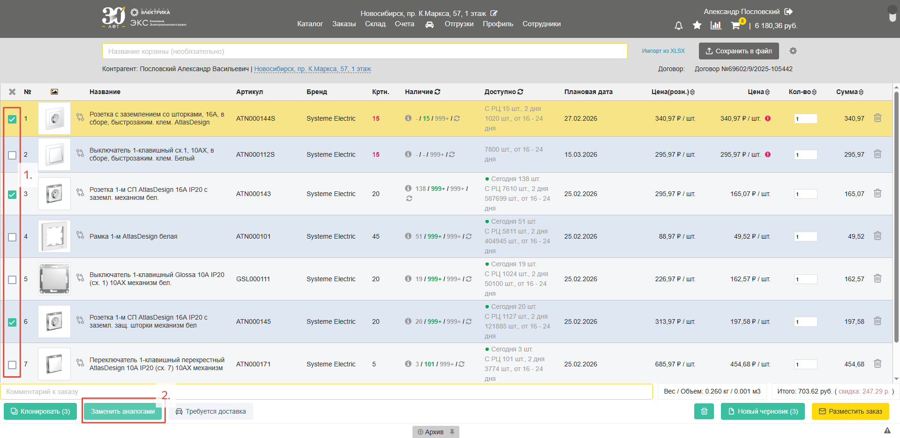

В ЭКС.Бизнес реализован функционал, позволяющий произвести замену товара на альтернативный вариант прямо из корзины. Это может быть особенно актуально для ситуаций, когда нужной позиции нет в наличии или необходимо подобрать более выгодный вариант. Есть несколько способов это сделать 

## Замена одной позиции

Для это нажмите на кнопку «**Аналоги**» в строке товарной позиции (*1.*). В открывшейся сравнительной таблице, если необходимо, укажите требуется ли **товар в наличии** (*2.*) и **отсортируйте** по стоимости или популярности (*3.*). Произведите замену товара из корзины нажатием кнопки «**Заменить**» (*4.*):

## Массовая замена

Нажмите кнопку «**Заменить аналогами**» (*1.*). Открывшаяся форма дает возможность произвести замену одновременно нескольких позиций. Выберите бренд, на который хотите произвести замену (*2.*) либо оставьте поле пустым, чтобы посмотреть все варианты. Нажмите кнопку «**Найти аналоги**» (*3.*):

Система автоматически заменит на тот товар, которого больше всего в наличии (*4.*). Если подобранный вариант не подходит, в столбике «**Найдено**» указано количество найденных аналогов от нужного бренда, нажмите на него, чтобы увидеть альтернативные варианты (*5.*). Выберите позиции которые хотите заменить (*6.*) и нажмите кнопку «**Сохранить изменения**» (*7.*):

Высветиться окно «**Подтвердите действие**» в котором предлагается **сохранить исходный набор товаров как черновик**:

После проведения процедуры замены товаров новые позиции в корзине заменят исходные.

## Выборочная замена

Если требуется изменить только конкретные позиции, выберите их **выделением** (*1*.) и нажмите «**Заменить аналогами**». Далее, провести замену по тому же процессу как в предыдущем пункте:

