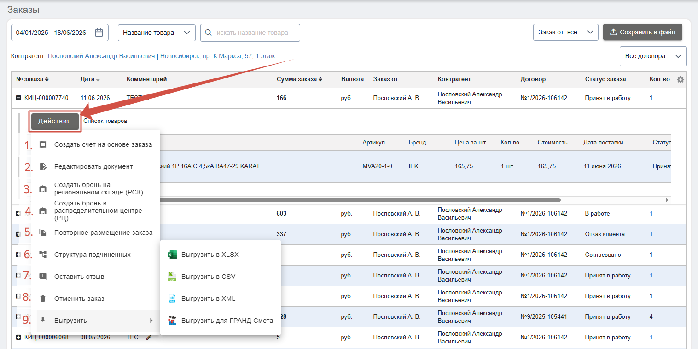
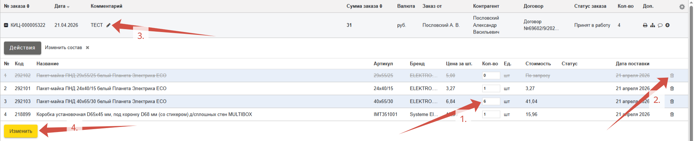
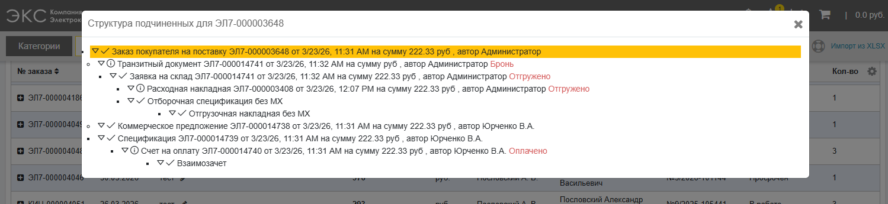
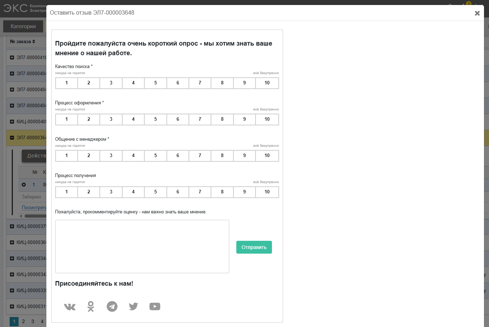
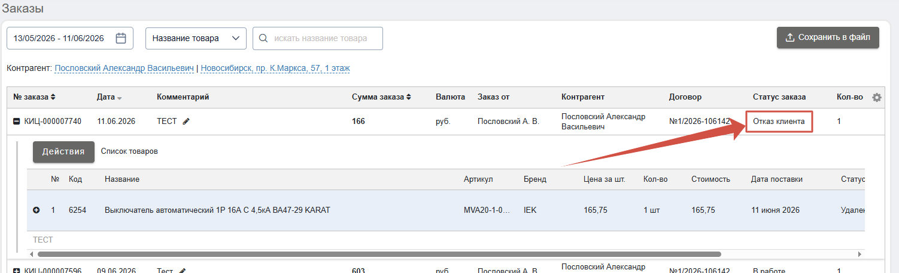
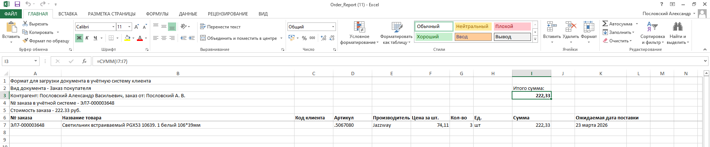

В каждом раскрытом заказе есть кнопка «**Действия**», позволяющая клиенту самостоятельно, без участия менеджера, проделывать различные манипуляции с заказом: 

## 1. Создать счет на основе заказа

Клиент может **самостоятельно выставить и оплатить счет по заказу**. 

*Функционал подробно описан в разделе [Работа со счетом](/content/10-invoices/invoice-creation.qmd)*.

## 2. Редактировать документ

Действие позволяет **изменить количество** единиц товара (*1.*), **удалить позицию** (*2.*) или **изменить комментарий** (*3.*) к заказу. Для подтверждения нажмите кнопку «**Изменить**» (*4.*). Работает только с заказами у которых **еще нет подчиненных документов** (счета, брони и др.). 

## 3. Создать бронь на региональном складе (РСК)

Позволяет **самостоятельно забронировать товар на региональном складе** (Красноярск, Иркутск, Кемерово, Барнаул). Работает только для клиентов, которые закреплены в региональных филиалах. Механизм бронирования тот же, что и для РЦ.

*Функционал подробно описан в разделе [Бронирование](/content/09-reservations/reservations.qmd)*.

## 4. Создать бронь в распределительном центре (РЦ)

Позволяет **самостоятельно забронировать товар в распределительном центре** (главном складе в Новосибирске). Работает только для клиентов, которые закреплены в Новосибирске и близлежащих филиалах.

*Функционал подробно описан в разделе [Бронирование](/content/09-reservations/reservations.qmd)*.

## 5. Повторное размещение заказа

Действие позволяет **повторно добавить список товаров** из заказа в корзину.

## 6. Структура подчиненных

Позволяет увидеть **структуру всех подчиненных документов**, которые заводились в системе ЭКС по заказу. 

## 7. Оставить отзыв

Позволяет **оценить удовлетворенность** взаимодействием с компанией ЭКС. 

## 8. Отменить заказ

У клиента есть возможность самостоятельно **отменить заказ** в случае если над ним еще не проводилось операций (не создавались подчиненные документы). В противном случае, для внесения изменений в заказ или его отмене необходимо обратиться к своему ответсвтвенному менеджеру. Отмененный заказ получит статус Отказ **клиента**.

## 9. Выгрузить документ заказа

Позволяет **скачать спецификацию** заказа в различных форматах. Ниже приведен пример сформированной спецификации в формате Excel.

