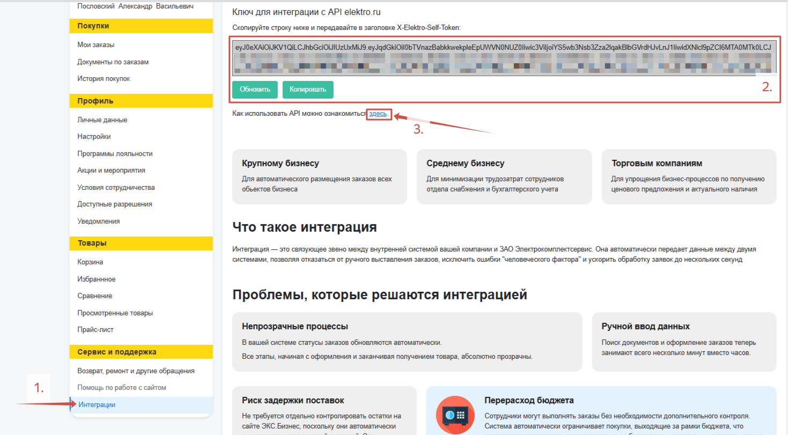

Платформа ЭКС.Бизнес может быть интегрирована с внутренней учетной системой клиента (**1С, СБИС** и др.) за счет подключения по **API**. С преимуществами и возможностями API можно ознакомиться на странице Профиль, вкладке **Интеграции** (*1.*).  

После выдачи менеджером разрешения на подключение API, на странице появится окно с **Ключем API** (*2.*), который разработчик вашей внутренней учетной системы может использовать для интеграции с ЭКС.Бизнес. **Технический документ** для подключения расположен **по этой ссылке** (*3.*):  

